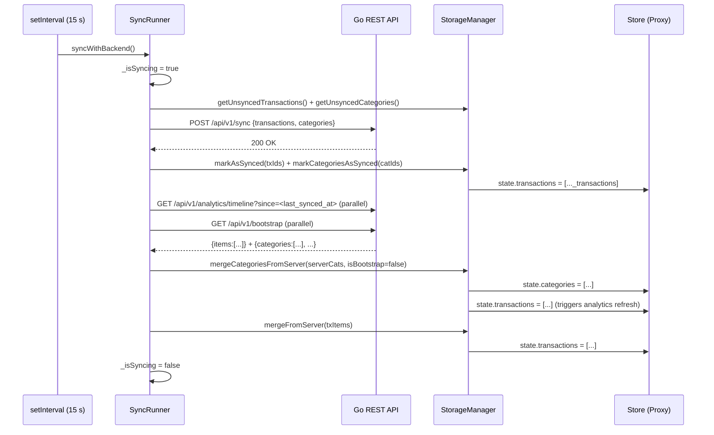

# FlowMoney — System Architecture Specification

> **Single Source of Truth.** Full static-analysis audit of all live source files, 2026-07-02.
> Supersedes the 2026-07-01 revision. Re-derived from source after 26 commits (`d9b8cb8..2eab1ac`) touching
> exclusively the frontend: category drag-and-drop reordering, a two-step swipe-delete confirmation flow,
> a scroll-boundary lock for the category sheet, and a wide CSS design-system pass (typography scale,
> transition timing, focus states, touch-target sizing, two new `@media` breakpoints). The Go backend,
> database schema, and sync wire-format are byte-for-byte unchanged since the last audit — verified via
> `git diff d9b8cb8..HEAD -- ':!frontend' ':!ARCHITECTURE.md'` (zero hits).
>
> A separate, narrower UI/UX punch-list (`ui_ux.md`, last touched 2026-07-01 21:52) was found in the
> repository root. It predates roughly half of the above commits; §7.3 reconciles its findings against
> current `HEAD` — several of its "Critical" items are now resolved, some are not.

---

## 1. SYSTEM OVERVIEW & ARCHITECTURAL STYLE

### 1.1 Stack

| Layer | Technology | Version / Detail |
|---|---|---|
| Language | Go | 1.21 (`go.mod`) |
| HTTP router | `github.com/go-chi/chi/v5` | v5.1.0 |
| DB driver | `pgx/v5` (pgxpool) | v5.6.0 |
| Database | PostgreSQL | 16-alpine (docker-compose) |
| Direct Go deps | — | **Two** runtime deps: chi, pgx. Zero ORM. |
| Query generator | sqlc v1.31.1 | `sqlc.yaml` → `internal/repository/postgres/` |
| Frontend | Vanilla JS + CSS | No framework, no bundler, no transpiler, no TypeScript |
| Container | Docker multi-stage | `golang:1.21-alpine` → `alpine:3.19` |
| Reverse proxy | Caddy | Not in repo; assumed production TLS termination |
| CI/CD | GitHub Actions | SSH → `git pull` → `docker compose up --build` → homegrown migration runner |
| Migration tracker | Homegrown shell + `_schema_migrations` table | Not golang-migrate |
| Exposed port | `8082:8082` | `docker-compose.yml`, `config.go` default `PORT=8080` overridden |

### 1.2 Architectural Pattern

```
┌─────────────────────────────────────────────────────────────────────┐
│   Telegram Mini App (WebView)                                       │
│   ┌────────────────────────────────────────────────────────────┐   │
│   │  Offline-First Event-Driven SPA (Vanilla JS + Proxy Store) │   │
│   │                                                            │   │
│   │  localStorage (transactions, categories, last_synced_at)  │   │
│   └────────────────────────────┬───────────────────────────────┘   │
└────────────────────────────────│────────────────────────────────────┘
                                 │ HTTPS / JSON REST (Telegram initData)
                    ┌────────────▼───────────────┐
                    │  Go REST API (chi)          │
                    │  pkg/tgauth — HMAC-SHA256   │
                    │  service/rates — 12 h tick  │
                    └────────────────────────────┘
                                 │ pgx/v5 pool
                    ┌────────────▼───────────────┐
                    │  PostgreSQL 16              │
                    │  (soft-delete everywhere)   │
                    └────────────────────────────┘
```

**Data lifecycle (user action → DB):**

1. User interaction → `handleAddTransaction()` / `CategoryCreationSheet._confirm()` / drag-reorder "Готово" tap
2. `StorageManager.saveTransactionLocally()` / `saveUserCategory()` / `reorderCategories()` — UUID assigned
   client-side, written to `localStorage`, `Store.state` updated immediately (optimistic update, `synced: false`)
3. UI reactively updates via `Store` Proxy subscriptions (zero network wait)
4. `SyncRunner.syncWithBackend()` fires (immediately out-of-band + every 15 s)
5. `_push()` — `POST /api/v1/sync` with pending transactions + categories (including reordered `sort_order`);
   server runs `UpsertCategory` / `UpsertTransaction` in a single DB transaction; on 200:
   `markAsSynced()` / `markCategoriesAsSynced()` clears `synced: false`
6. `_pull()` — concurrent `GET /api/v1/analytics/timeline` + `GET /api/v1/bootstrap`; server-side state
   merged into local store

### 1.3 Global Middleware Stack (chi)

Applied unconditionally to all routes, in order:

```
middleware.Logger → middleware.Recoverer → middleware.RealIP
```

`/api/v1/*` additionally wraps with `deliveryhttp.TelegramAuth(cfg.BotToken)`.

### 1.4 Required Environment Variables

| Variable | Default | Notes |
|---|---|---|
| `PORT` | `8080` | Overridden to `8082` in docker-compose |
| `TELEGRAM_BOT_TOKEN` | — | `mustEnv()` — panics if absent |
| `DB_USER` | — | `mustEnv()` |
| `DB_PASSWORD` | — | `mustEnv()` |
| `DB_NAME` | — | `mustEnv()` |
| `DB_HOST` | `localhost` | `getEnv()` with fallback |
| `DB_PORT` | `5432` | `getEnv()` with fallback |
| `DB_SSLMODE` | `disable` | `getEnv()` with fallback |

---

## 2. DATABASE & DATA SCHEMA

### 2.1 Full DDL — All 7 Migrations In Order

```sql
-- 000001_init_schema.up.sql

CREATE TABLE users (
    tg_id      BIGINT      PRIMARY KEY,
    currency   VARCHAR(10) NOT NULL DEFAULT 'USD',
    created_at TIMESTAMPTZ NOT NULL DEFAULT NOW(),
    updated_at TIMESTAMPTZ NOT NULL DEFAULT NOW()
);

CREATE TABLE categories (
    id         UUID        PRIMARY KEY,
    user_id    BIGINT      NOT NULL REFERENCES users(tg_id) ON DELETE CASCADE,
    name       VARCHAR(64) NOT NULL,
    color      VARCHAR(16) NOT NULL,
    icon       VARCHAR(64) NOT NULL,
    is_system  BOOLEAN     NOT NULL DEFAULT FALSE,
    sort_order INT         NOT NULL DEFAULT 0
);

CREATE INDEX idx_categories_user_id ON categories(user_id);

CREATE TABLE transactions (
    id          UUID           PRIMARY KEY,
    user_id     BIGINT         NOT NULL REFERENCES users(tg_id) ON DELETE CASCADE,
    category_id UUID           NOT NULL REFERENCES categories(id) ON DELETE RESTRICT,
    amount      DECIMAL(18, 2) NOT NULL CHECK (amount > 0),
    created_at  TIMESTAMPTZ    NOT NULL DEFAULT NOW(),
    is_deleted  BOOLEAN        NOT NULL DEFAULT FALSE
);

CREATE INDEX idx_transactions_user_id    ON transactions(user_id);
CREATE INDEX idx_transactions_created_at ON transactions(created_at DESC);
CREATE INDEX idx_transactions_user_timeline
    ON transactions(user_id, created_at DESC) WHERE is_deleted = FALSE;

CREATE TABLE budgets (
    user_id       BIGINT         PRIMARY KEY REFERENCES users(tg_id) ON DELETE CASCADE,
    weekly_limit  DECIMAL(18, 2) NOT NULL DEFAULT 0 CHECK (weekly_limit >= 0),
    monthly_limit DECIMAL(18, 2) NOT NULL DEFAULT 0 CHECK (monthly_limit >= 0)
);
```

```sql
-- 000002_seed_system_categories.up.sql
-- System user (tg_id = 0): sentinel owner of 8 legacy system categories.
-- IMPORTANT: the migration's own comment claims "GetCategoriesByUserId already
-- returns rows WHERE is_system = true for every user" — this is FALSE against the
-- live query (see §2.4, §7.2 TD-2). These categories are dead data.

INSERT INTO users (tg_id, currency, created_at, updated_at)
VALUES (0, 'USD', NOW(), NOW())
ON CONFLICT (tg_id) DO NOTHING;

INSERT INTO categories (id, user_id, name, color, icon, is_system, sort_order) VALUES
  ('11111111-1111-1111-1111-111111111101', 0, 'Еда',       '#FF6B6B', '🍕', true, 1),
  ('11111111-1111-1111-1111-111111111102', 0, 'Транспорт', '#4ECDC4', '🚇', true, 2),
  ('11111111-1111-1111-1111-111111111103', 0, 'Покупки',   '#45B7D1', '🛍️', true, 3),
  ('11111111-1111-1111-1111-111111111104', 0, 'Здоровье',  '#96CEB4', '💊', true, 4),
  ('11111111-1111-1111-1111-111111111105', 0, 'Кафе',      '#FFEAA7', '☕', true, 5),
  ('11111111-1111-1111-1111-111111111106', 0, 'Спорт',     '#DDA0DD', '⚽', true, 6),
  ('11111111-1111-1111-1111-111111111107', 0, 'Дом',       '#98D8C8', '🏠', true, 7),
  ('11111111-1111-1111-1111-111111111108', 0, 'Другое',    '#B0C4DE', '💡', true, 8)
ON CONFLICT (id) DO NOTHING;
```

```sql
-- 000003_add_transactions_updated_at.up.sql

ALTER TABLE transactions
    ADD COLUMN updated_at TIMESTAMPTZ NOT NULL DEFAULT NOW();

-- backfill: treat created_at as updated_at for existing rows
UPDATE transactions SET updated_at = created_at;

CREATE INDEX idx_transactions_user_updated_at
    ON transactions(user_id, updated_at ASC);
```

```sql
-- 000004_add_transactions_currency.up.sql

ALTER TABLE transactions
    ADD COLUMN currency VARCHAR(10) NOT NULL DEFAULT 'USD';
```

```sql
-- 000005_drop_budget_daily_limit.up.sql

ALTER TABLE budgets DROP COLUMN IF EXISTS daily_limit;
```

```sql
-- 000006_add_transaction_comment.up.sql

ALTER TABLE transactions ADD COLUMN comment VARCHAR(255) NOT NULL DEFAULT '';
```

```sql
-- 000007_add_categories_is_deleted.up.sql

ALTER TABLE categories ADD COLUMN is_deleted BOOLEAN NOT NULL DEFAULT false;
```

```sql
-- _schema_migrations (created inline by CI, not a migration file — see deploy.yml)
CREATE TABLE IF NOT EXISTS _schema_migrations (
    filename   TEXT        PRIMARY KEY,
    applied_at TIMESTAMPTZ DEFAULT now()
);
```

The CI runner (`.github/workflows/deploy.yml`) applies migrations by iterating `migrations/*.up.sql` in
lexical filename order, checking each against `_schema_migrations`, and `cat`-piping unapplied files
directly into `psql -v ON_ERROR_STOP=1` followed by an `INSERT ... ON CONFLICT DO NOTHING` ledger row —
in the *same* psql invocation, so a mid-file failure aborts before the ledger insert and the migration is
retried whole on the next deploy. There is no `.down.sql` counterpart anywhere in `migrations/` — rollback
is not supported by tooling; a bad migration must be fixed forward.

### 2.2 Full `transactions` Schema (Post All Migrations)

```sql
transactions (
    id          UUID           PRIMARY KEY,
    user_id     BIGINT         NOT NULL REFERENCES users(tg_id) ON DELETE CASCADE,
    category_id UUID           NOT NULL REFERENCES categories(id) ON DELETE RESTRICT,
    amount      DECIMAL(18, 2) NOT NULL CHECK (amount > 0),
    created_at  TIMESTAMPTZ    NOT NULL DEFAULT NOW(),
    is_deleted  BOOLEAN        NOT NULL DEFAULT FALSE,
    updated_at  TIMESTAMPTZ    NOT NULL DEFAULT NOW(),   -- migration 000003
    currency    VARCHAR(10)    NOT NULL DEFAULT 'USD',   -- migration 000004
    comment     VARCHAR(255)   NOT NULL DEFAULT ''       -- migration 000006
)
```

**Indexes on `transactions`:**

| Index | Columns | Condition | Used by |
|---|---|---|---|
| `idx_transactions_user_id` | `(user_id)` | — | General user scoping |
| `idx_transactions_created_at` | `(created_at DESC)` | — | Standalone sort queries |
| `idx_transactions_user_timeline` | `(user_id, created_at DESC)` | `WHERE is_deleted = FALSE` | `GetTimelineWithCursor` — cursor pagination |
| `idx_transactions_user_updated_at` | `(user_id, updated_at ASC)` | — | `GetTransactionsDelta` — delta sync |

### 2.3 Full `categories` Schema (Post All Migrations)

```sql
categories (
    id         UUID        PRIMARY KEY,
    user_id    BIGINT      NOT NULL REFERENCES users(tg_id) ON DELETE CASCADE,
    name       VARCHAR(64) NOT NULL,
    color      VARCHAR(16) NOT NULL,
    icon       VARCHAR(64) NOT NULL,
    is_system  BOOLEAN     NOT NULL DEFAULT FALSE,
    sort_order INT         NOT NULL DEFAULT 0,
    is_deleted BOOLEAN     NOT NULL DEFAULT false  -- migration 000007
)
```

`sort_order` has no `UNIQUE` or `CHECK` constraint — duplicates and gaps are both legal at the DB layer.
The client is solely responsible for producing a dense, unique ordering per user (see §3.7).

**Key constraints:**

| Constraint | Meaning |
|---|---|
| `ON DELETE CASCADE` (categories → users) | Deleting a user wipes their categories |
| `ON DELETE CASCADE` (transactions → users) | Deleting a user wipes their transactions |
| `ON DELETE RESTRICT` (transactions → categories) | A category cannot be hard-deleted while transactions reference it; soft-delete is the only supported path |
| `CHECK (amount > 0)` | No zero or negative amounts at DB level; no upper bound at DB level (see §7.5) |
| `WHERE categories.user_id = EXCLUDED.user_id` in `UpsertCategory` | UUID collision between users silently no-ops — prevents cross-user data mutation |

### 2.4 Named SQL Queries

| Query | Signature | Notes |
|---|---|---|
| `UpsertUser` | `(tg_id, currency) → User` | Creates user if absent; always sets `updated_at = NOW()` — acts as a login ping. Bootstrap always calls this with the literal `"USD"`, but `ON CONFLICT DO UPDATE SET updated_at = NOW()` never touches the `currency` column, so an existing user's currency is never clobbered. |
| `GetBudgetsByUserId` | `(user_id) → Budget` | Returns `pgx.ErrNoRows` if no budget row; handled in bootstrap handler |
| `GetCategoriesByUserId` | `(user_id) → []Category` | `WHERE user_id = $1 AND is_deleted = false ORDER BY sort_order ASC` — **does NOT return system categories (user_id=0) or soft-deleted entries**, and does **not** de-duplicate `sort_order` ties (ties fall back to whatever stable order Postgres returns them in) |
| `GetAnalyticsDonut` | `(user_id) → []donutItem` | Server-side aggregation using the server's wall-clock month boundary (`DATE_TRUNC('month', NOW())`); **UNUSED** — frontend calls `computeLocalDonutData()` instead |
| `GetTimelineWithCursor` | `(user_id, cursor TIMESTAMPTZ, limit int32) → []Transaction` | Cursor pagination; non-deleted only; uses `idx_transactions_user_timeline` |
| `GetTransactionsDelta` | `(user_id, updated_at TIMESTAMPTZ) → []Transaction` | Delta sync; includes `is_deleted=true`; `ORDER BY updated_at ASC` |
| `UpsertTransaction` | `UpsertTransactionParams → exec` | `ON CONFLICT (id) DO UPDATE`; `updated_at = NOW()` is server-assigned, never client-supplied |
| `UpdateUserCurrency` | `(tg_id, currency) → exec` | Sets `updated_at = NOW()` |
| `UpsertBudget` | `(user_id, weekly_limit, monthly_limit) → exec` | `ON CONFLICT (user_id) DO UPDATE` |
| `UpsertCategory` | `UpsertCategoryParams → exec` | `ON CONFLICT (id) DO UPDATE WHERE categories.user_id = EXCLUDED.user_id`; writes `sort_order` verbatim from the client — the reorder feature (§3.7) rides this exact same upsert, there is no dedicated reorder endpoint |

---

## 3. SYNC ENGINE PROTOCOL & CONFLICT RESOLUTION

### 3.1 Architecture Overview

`SyncRunner` is a private IIFE module (`frontend/js/sync.js`) exposed as `window.SyncRunner`.

**Tick mechanism:**
- `SyncRunner.start()` wires `setInterval(syncWithBackend, 15_000)` + `window.addEventListener('online', syncWithBackend)`.
- An immediate attempt fires if `navigator.onLine === true` at startup.
- `SyncRunner.syncWithBackend()` is also called out-of-band immediately after every transaction save/delete/duplicate
  and every category save/edit/delete/**reorder**.

**Mutex:** `_isSyncing` boolean prevents concurrent cycles. If a cycle is already in-flight, `syncWithBackend()`
returns immediately. The flag is released in a `finally` block.

**Error handling:** All network errors are swallowed (`console.warn`). The cycle fails gracefully; the next
tick or `online` event retries.



### 3.2 Push Phase (`_push`)

```
pending    = StorageManager.getUnsyncedTransactions()  // filter: !tx.synced
pendingCat = StorageManager.getUnsyncedCategories()    // filter: !cat.synced

if pending.length === 0 AND pendingCat.length === 0 → early return (no network call)

POST /api/v1/sync {
  "transactions": pending,
  "categories": pendingCat.map(c => { id, name, color, icon, sort_order, is_deleted })
}

→ 200 OK:
    StorageManager.markAsSynced(txIds)         // sets synced: true, _pending: false
    StorageManager.markCategoriesAsSynced(catIds)
→ non-2xx: throw Error → caught by syncWithBackend, retry next tick
```

**Server-side ordering:** `NewSyncHandler` processes `categories` first, then `transactions`, inside one
`pgx.Tx`. This guarantees referential integrity: a transaction referencing a newly-created category will
not fail the FK constraint `transactions → categories`.

**Idempotency:** both `UpsertTransaction` and `UpsertCategory` use `ON CONFLICT (id) DO UPDATE`. Retrying
the same batch is safe.

**Optimistic UI:** `saveTransactionLocally()` writes to localStorage and sets `Store.state.transactions`
immediately. The `synced: false` flag causes a `.sync-pending` indicator in the timeline until
`markAsSynced()` clears it.

**Transaction safety net — missing.** `NewSyncHandler` (`internal/delivery/http/sync.go:60-134`) calls
`pool.BeginTx` and then, on every one of its five distinct error branches (invalid category UUID line 72,
`UpsertCategory` failure line 87, invalid transaction UUID line 96, invalid `category_id` UUID line 103,
`UpsertTransaction` failure line 124), manually calls `tx.Rollback(r.Context())` before returning. There is
**no `defer tx.Rollback(ctx)` immediately after `BeginTx`** the way idiomatic pgx code does (`Rollback`
after a successful `Commit` is a documented no-op, so the defer pattern is normally unconditionally safe).
See TD-9 (§7.2) for the consequence.

### 3.3 Pull Phase (`_pull`)

`_pull` issues two requests **concurrently** via `Promise.all`:

```
[txRes, bootstrapRes] = await Promise.all([
  GET /api/v1/analytics/timeline?since=<last_synced_at>   // if last_synced_at exists
  GET /api/v1/analytics/timeline?limit=200                // if first pull
  ,
  GET /api/v1/bootstrap
])
```

**Category pull (from bootstrap response):**

```
if bootstrapRes.ok:
  serverCats = bData.categories ?? []
  StorageManager.mergeCategoriesFromServer(serverCats, isBootstrap=false)
```

`bootstrap` is called every 15 seconds (not just at app start). This is the mechanism by which cross-device
category changes — creates, edits, soft-deletes, **and reorders** — propagate without a page reload. It is
also the mechanism that can interrupt an in-progress drag-reorder gesture; see §5.6 and TD-10.

**Transaction pull:**

| Condition | URL | Backend query | Includes `is_deleted: true` records? |
|---|---|---|---|
| `getLastSyncedAt() === null` (first ever sync) | `?limit=200` | `GetTimelineWithCursor` | No |
| Subsequent syncs | `?since=<last_synced_at>` | `GetTransactionsDelta` | **Yes** |

After a successful delta pull, `mergeFromServer(data.items)` scans all items for the maximum `updated_at`
and persists it to `localStorage['flowmoney_last_synced_at']` — advancing the delta window for the next
cycle.

### 3.4 Transaction Conflict Resolution (`StorageManager.mergeFromServer`)

Per-record merge rules applied in `storage.js:181-229`:

| Condition | Action |
|---|---|
| `serverTx.is_deleted === true` | `localMap.delete(serverTx.id)` — hard-remove from client state |
| `serverTx.id` not in `localMap` | Insert as new (`synced: true, _pending: false`) |
| `localMap[id]._pending === true` | **Skip** — record is in-flight; server must not overwrite |
| `localMap[id]._pending === false` | Replace with server version (`synced: true`) |

**Currency field preservation:**
```js
const currency = (local && local.currency) || serverTx.currency || Store.state.currency || 'RUB';
```
Priority: `local.currency` › `serverTx.currency` › current app currency › `'RUB'`. The server response never
carries a currency field mismatch risk here because `deltaItem`/`timelineItem` (Go) always serialize the
stored `currency` column — this fallback chain exists purely for defense against a local record predating
migration 000004 or a transient merge race, not because the server omits the field.

### 3.5 Soft-Delete Retention Invariant (Categories)

Deleted categories are **retained** in the local `_userCategories` array with `is_deleted: true`. They are
never removed from `Store.state.categories`. This is intentional:

- `CategoryCarousel.render()` filters `categories.filter(c => !c.is_deleted)` — deleted categories do not
  appear in the creation carousel or the drag-reorder surface.
- `DonutChart.renderTimeline()` and `loadAnalyticsData()` look up categories from `Store.state.categories`
  (which includes deleted ones). A transaction referencing a deleted category still resolves its `name`,
  `color`, and `icon` correctly, preventing "Неизвестная" fallbacks in historical data.
- **New in this revision:** `DonutChart.renderTimeline()` (`charts.js:218,233`) now also applies a visible
  `.timeline-item--archived` CSS class (`opacity: 0.55`, `style.css:890-892`) whenever the resolved category
  has `is_deleted === true`. The soft-delete retention invariant is no longer purely a data-correctness
  mechanism — it now has a matching UI treatment that visually flags "this transaction's category no longer
  exists" without breaking the row's name/color/icon rendering.
- If deleted categories were removed from the store, every historical transaction referencing them would
  display with `color: '#888888'` and `name: 'Неизвестная'` (the fallback defaults in `charts.js`).

### 3.6 Category Merge Rules (`StorageManager.mergeCategoriesFromServer`)

Two modes, controlled by the `isBootstrap` parameter (`storage.js:315-383`):

**Bootstrap mode (`isBootstrap = true`):**
- Server list is absolute truth.
- Any local category absent from `serverCats` is marked `{ is_deleted: true, synced: true }`,
  **regardless of its `synced` flag**.
- This evicts zombie categories created on another client that were never confirmed by the server — and,
  as an unwanted side effect, also evicts the three freshly-seeded, never-yet-synced default categories on
  a brand-new user's very first launch. See TD-1 (§7.2), unchanged since the previous audit.

**Background pull mode (`isBootstrap = false`):**
- Only evicts local entries where `synced === true` (i.e., previously confirmed by server) that are absent
  from `serverCats`.
- Entries with `synced === false` (unconfirmed, in-flight — including a category mid-reorder that has not
  yet round-tripped through `_push`) are not evicted — they may legitimately be ahead of the server.

**Per-server-category rules:**

| Condition | Action |
|---|---|
| `serverCat.is_deleted === true` | Mark local copy `is_deleted: true, synced: true` (retain in store for history) |
| `local.synced === false` | Skip — local is in-flight; server data is stale relative to it |
| Otherwise | Overwrite local with server version (`synced: true`), **including `sort_order`** |

**UI update path (non-bootstrap only):**
After `_userCategories` is updated, `mergeCategoriesFromServer` explicitly calls:
1. `Store.state.categories = result` — triggers all Store `categories` subscribers
2. `Store.state.transactions = [...]` — forces analytics to refresh category names/colors
3. `CategoryCarousel.render(result)` — directly re-renders the carousel

The direct `CategoryCarousel.render` call bypasses the Store subscription (`Store.subscribe('categories', ...)`)
to handle edge cases where the `Array.isArray` guard in the subscriber might short-circuit an empty-array
eviction. It also means the carousel DOM is unconditionally torn down and rebuilt on **every** background
sync tick that changes anything about the category set — see §5.6 and TD-10 for why this collides with an
in-progress drag gesture.

### 3.7 Category Reorder Sync Flow (New)

Custom category ordering (drag-and-drop inside a dedicated "reorder mode") is **not** a new API endpoint or
wire message type — it is a client-side reinterpretation of the existing `sort_order` field, riding the
exact same `UpsertCategory` upsert and the exact same `categories` array in the `POST /api/v1/sync` body
described in §3.2.

**End-to-end flow:**

```
1. User long-presses a category → CategoryCreationSheet.open(cat) [edit mode]
2. User taps "Изменить порядок" (#category-reorder-btn) → sheet closes,
   Store.state.isReorderingMode = true
3. Store.subscribe('isReorderingMode') → CategoryCarousel._setReorderingMode(true)
     → carousel gets .reordering-mode class, "+" button hidden, "Готово" button shown
4. User drags .category-item elements via Pointer Events (app.js:722-793, see §5.6);
   each drag frame reorders the live DOM via insertBefore — this is PURE DOM
   manipulation, Store.state.categories is untouched during the drag itself
5. User taps "Готово" (#category-reorder-done-btn):
     a. Reads final order: querySelectorAll('#category-carousel .category-item') → dataset.id[]
        (elements without a data-id, e.g. a stray "+" button, are skipped defensively)
     b. StorageManager.reorderCategories(orderedIds)
          → for each id at DOM index i: if cat.sort_order !== i, rewrite
            { ...cat, sort_order: i, synced: false } — only genuinely-moved categories
            are touched; categories whose position didn't change keep synced: true
          → localStorage[CATEGORIES_KEY] persisted
          → Store.state.categories = getUserCategories()  (re-renders the carousel
            in final settled order, exits jiggle animation via the isReorderingMode
            watcher below)
     c. SyncRunner.syncWithBackend() fires immediately (out-of-band, not waiting for
        the 15 s tick)
     d. Store.state.isReorderingMode = false → carousel drops .reordering-mode,
        "Готово" hidden, "+" restored
6. SyncRunner._push() picks up every category with synced:false (i.e. every category
   whose numeric position actually moved) and PUTs its full record — including the
   new sort_order — through the standard categories[] array in POST /api/v1/sync
7. UpsertCategory (ON CONFLICT DO UPDATE) persists sort_order server-side; no
   uniqueness or contiguity is enforced by the DB (§2.3)
8. GetCategoriesByUserId (ORDER BY sort_order ASC) returns the new order to every
   client on the next bootstrap/pull
```

**Why only moved categories are marked `synced: false`:** `reorderCategories` diffs each category's
*existing* `sort_order` against its new DOM-derived index before rewriting it (`storage.js:284-291`,
`if (cat.sort_order !== index || cat.synced !== false)`). If a user drags category C from position 4 to
position 1, categories originally at positions 1–3 are shifted to 2–4 and *are* rewritten (their numeric
`sort_order` changed), while anything at position 5+ that didn't move keeps its existing `synced` state.
In practice, any drag that changes the target's position touches every category between the old and new
slot, so this optimization saves a sync payload write only for categories entirely outside the affected
range.

**No dedicated reorder endpoint, no batch/atomic guarantee across categories.** Because reordering is
just N individual rows inside the same `categories[]` upsert loop used for renames/creates/deletes, a
reorder of 5 categories produces 5 `UpsertCategory` calls inside one DB transaction (so they commit
atomically as a *batch* — either all 5 land or none do, per the sync transaction), but there is no
application-level invariant enforced that the *resulting* `sort_order` values are contiguous or unique
after a partial failure elsewhere in the same sync payload (e.g. if a transaction later in the same
request fails and rolls back the whole tx, the reorder is retried whole on the next tick — safe, thanks to
idempotent upserts — but there is no server-side validation that sort_order values sent by a given client
are internally consistent; a buggy or malicious client could push duplicate or gapped values with no
rejection).

---

## 4. FRONTEND ARCHITECTURE & LIFE-CYCLE

### 4.1 Application Cold Start Sequence

```mermaid
flowchart TD
    A[DOMContentLoaded] --> B[Zoom locks: touchstart, gesturestart, touchend]
    B --> C[initTelegram: tg.ready, tg.expand, disableVerticalSwipes,\nlockBodyHeight, safeAreaInsets]
    C --> D[initTheme: applyTheme + themeChanged subscription]
    D --> E[updateAnalyticsRange: compute start/end for 'month'\nStore.state.analyticsRange = {start, end}]
    E --> F[StorageManager.init: load _transactions from localStorage\nlegacy category migration check\nload _userCategories\nseed 3 defaults if first run\nStore.state.transactions = copy]
    F --> G[Settings.init: load budgets from localStorage\nStore subscriptions: weeklyLimit, monthlyLimit, transactions, rates]
    G --> H[BudgetCard.init: wire period toggle, Store subscriptions]
    H --> I[initBindings: Store subscriptions → DOM]
    I --> J[Router.init: wire nav tabs, currentTab = 'home']
    J --> K[NumPad.init: pointerdown delegation]
    K --> L[CategoryCreationSheet.init: emoji grid, color palette,\nscroll-boundary lock]
    L --> M[CategoryCarousel.init: delegated tap/long-press + drag-reorder listeners\nStore.subscribe categories, isReorderingMode]
    M --> N[initAnalytics: Store subscriptions for currentTab, selectedAnalyticsCategory, transactions\ninitPeriodSwitcher, CalendarSheet.init, SwipeGesture.init]
    N --> O[initNetworkWatcher: online/offline → Store.state.isOnline]
    O --> P{Promise.all}
    P --> Q[bootstrap: GET /api/v1/bootstrap\nmergeCategoriesFromServer isBootstrap=true\nStore.batchUpdate, CategoryCarousel.render explicit call]
    P --> R[wait 400ms min skeleton]
    Q --> S[hideSkeleton: fade-out 280ms, #app visible]
    R --> S
    S --> T[CategoryCarousel.render with Store.state.categories]
    T --> U[initialPull: GET /api/v1/analytics/timeline?limit=200\nStorageManager.mergeFromServer]
    U --> V[SyncRunner.start: immediate syncWithBackend if online\nsetInterval 15 000ms\nonline event listener]
```

**Critical ordering constraints:**
- `updateAnalyticsRange()` must run before any analytics subscription fires — it populates
  `Store.state.analyticsRange` with valid Unix-ms timestamps before the Store Proxy is subscribed to.
- `StorageManager.init()` must run before `Settings.init()` so `Store.state.transactions` exists when
  progress bars are computed.
- `bootstrap()` is gated behind `Promise.all` with a 400 ms minimum — ensures skeleton is shown ≥ 400 ms
  regardless of network speed.
- `CategoryCarousel.render` is called twice at the end of `init()`: once inside `bootstrap()` on the merged
  server result, and once after `Promise.all` resolves. This double-call ensures the carousel always
  reflects the final merged state even if `bootstrap()` modifies it after the internal `Store.batchUpdate`.
- `SyncRunner.start()` fires after `hideSkeleton()` — background sync never races with the *initial*
  render, but nothing prevents it from racing with *later* user interaction (§5.6, TD-10).
- All gesture/drag/scroll-lock listeners (`CategoryCreationSheet.init`, `CategoryCarousel.init`,
  `SwipeGesture.init`) are wired up **before** `bootstrap()` resolves and before `Store.state.rates` is
  populated — see TD-11 for the consequence on the swipe-duplicate feature.

### 4.2 State Management Contract (`Store`)

`Store` is a private IIFE (`frontend/js/store.js`) that wraps a plain object in a recursive ES6 `Proxy`.
Exposed as `window.Store`.

**Initial state keys (declared in `_initialState`, `store.js:14-40`):**

| Key | Type | Initial value | Notes |
|---|---|---|---|
| `currency` | `string` | `'₽'` | **Bug: initialized as symbol, not code.** Should be `'RUB'`. Replaced by bootstrap. See TD-4. |
| `weeklyLimit` | `number` | `0` | Replaced by Settings.init and bootstrap |
| `monthlyLimit` | `number` | `0` | Replaced by Settings.init and bootstrap |
| `inputAmount` | `string` | `''` | NumPad input |
| `selectedCategory` | `string\|null` | `null` | Selected category UUID for new transaction |
| `isReorderingMode` | `boolean` | `false` | **New.** Toggles category drag-reorder mode; see §3.7, §5.6 |
| `categories` | `Array` | `[]` | User category objects (includes `is_deleted` entries) |
| `transactions` | `Array` | `[]` | All transactions including soft-deleted |
| `pendingSync` | `Array` | `[]` | Unused in current code; legacy field |
| `isOnline` | `boolean` | `navigator.onLine` | |
| `analyticsPeriod` | `string` | `'month'` | `'day' \| 'month' \| 'custom'` |
| `analyticsRange` | `Object` | `{start: null, end: null}` | Unix-ms numbers; set by `updateAnalyticsRange()` |

**Dynamically added keys (not in `_initialState`):**

| Key | Set by | Subscribed by |
|---|---|---|
| `currentTab` | `Router.navigateTo()`, `Router.init()` | `initAnalytics()` |
| `selectedAnalyticsCategory` | `DonutChart._onTap()`, `DonutChart.resetFilter()` | `initAnalytics()` |
| `analyticsDonut` | `loadAnalyticsData()` | No subscriber (used as cache) |
| `rates` | `Store.batchUpdate` in `bootstrap()` | `Settings.subscribe('rates')`, `BudgetCard.subscribe('rates')` |

Note that `isReorderingMode` — unlike the four keys above — *was* correctly added to `_initialState` when
the reorder feature was built, so `Store.reset()` does correctly restore it. The four legacy dynamic keys
were not; TD-5 (§7.2) is unchanged.

**Proxy behavior:**

```js
set(obj, prop, value) {
  if (old === value) return true;  // reference equality → no notification
  obj[prop] = value;
  _notify(rootKey || prop, value);
  if (rootKey) _notify(prop, value); // also by sub-key
  return true;
}
get(obj, prop) {
  if (val is object) return _makeProxy(val, prop);  // nested proxy wrapping
  return val;
}
```

**Reference-equality bypass — known limitation:** Mutations to the same array/object reference
(`arr.push(x)`) do NOT trigger notifications because `old === value` (same reference). The codebase works
around this by always assigning a new array copy: `Store.state.transactions = [..._transactions]`. Nested
object mutations via the Proxy DO fire, but only for the sub-key. The drag-reorder feature (§5.6)
deliberately mutates the carousel's DOM order **without** touching `Store.state.categories` at all during
the drag — it only writes to the Store once, at the end, via `reorderCategories()` — which sidesteps this
limitation but is also the root cause of TD-10 (in-progress drag state has no Store-level representation).

**`Store.batchUpdate(partial)`:** Sets all fields in `_state` directly (bypassing the Proxy `set` trap),
then fires `_notify` once per key. Used during `bootstrap()` to batch-update `currency`, `weeklyLimit`,
`monthlyLimit`, `categories`, `rates` without intermediate re-renders.

**`Store.subscribe(key, fn)`:** Registers `fn` in `_subscribers[key][]`; fires `fn` immediately with the
current value; returns an unsubscribe function. No subscriptions are ever unsubscribed in the current
codebase (all are permanent for the SPA lifetime).

### 4.3 Component Map & Render Mechanics

| Component | Module | Init location | Re-render trigger |
|---|---|---|---|
| `CategoryCarousel` | `app.js` IIFE | `CategoryCarousel.init()` | `Store.subscribe('categories')` + explicit `render(cats)` calls + `Store.subscribe('isReorderingMode')` |
| `CategoryCreationSheet` | `app.js` IIFE | `CategoryCreationSheet.init()` | `open(cat)` / `open()` — imperative |
| `BudgetCard` | `app.js` IIFE | `BudgetCard.init()` | `Store.subscribe('weeklyLimit', 'monthlyLimit', 'transactions', 'currency', 'rates')` |
| `DonutChart` | `charts.js` IIFE | Called from `loadAnalyticsData()` | `loadAnalyticsData()` via `Store.subscribe('transactions')` |
| `Timeline` (part of `DonutChart`) | `charts.js` IIFE | Called from `renderTimelineFromStore()` | Same as donut + `Store.subscribe('selectedAnalyticsCategory')` |
| `Settings` | `settings.js` IIFE | `Settings.init()` | `Store.subscribe('weeklyLimit', 'monthlyLimit', 'transactions', 'currency', 'rates')` |
| `CalendarSheet` | `app.js` IIFE | `CalendarSheet.init()` | Imperative: `open('start'|'end')` |
| `SwipeGesture` | `gestures.js` IIFE | `SwipeGesture.init(timelineEl, {onDelete, onDuplicate})` | Pointer events, not Store-driven; two-step delete state machine (§5.5) |
| `Router` | `app.js` IIFE | `Router.init()` | `pointerdown` on `.nav-tab` |
| `NumPad` | `app.js` IIFE | `NumPad.init()` | `Store.subscribe('inputAmount')` via `initBindings()` |

### 4.4 localStorage Keys

| Key | Owner | Content |
|---|---|---|
| `flowmoney_transactions` | `StorageManager` | `JSON.stringify(_transactions)` — full transaction objects including `synced`, `_pending` fields |
| `flowmoney_last_synced_at` | `StorageManager` | RFC3339 string — maximum `updated_at` from last successful delta pull |
| `flowmoney_user_categories` | `StorageManager` | `JSON.stringify(_userCategories)` — all categories including soft-deleted, with `synced` and `sort_order` fields |
| `flowmoney_budgets` | `Settings` | `{weeklyLimit, monthlyLimit}` — offline persistence of budget limits |

### 4.5 Category Lifecycle (Client-Side)

```
User taps "+" → CategoryCreationSheet.open()
User fills name/emoji/color → _confirm()
  → duplicate-color guard: swatches already used by another active (non-deleted)
    category are disabled in the palette (_getUsedColors / _renderColorPalette,
    app.js:297-327); the category's own current color stays selectable in edit mode
  → StorageManager.saveUserCategory({...cat, synced: false})
    → _userCategories.push(entry)      // sort_order = current array length
    → localStorage[CATEGORIES_KEY] = JSON.stringify(...)
    → Store.state.categories = [...existing, entry]  ← triggers CategoryCarousel.render

User long-presses category (500 ms) → CategoryCreationSheet.open(cat)  [edit mode]
  → sheet now also exposes "Изменить порядок" (reorder-mode entry point, §3.7)
User saves → StorageManager.updateUserCategory({...cat, synced: false})
User deletes → StorageManager.updateUserCategory({...cat, is_deleted: true, synced: false})
  → Store.state.categories updated → CategoryCarousel.render filters out is_deleted entries
  → category stays in store for history resolution (§3.5), now also dims referencing
    transactions via .timeline-item--archived

User drags to reorder → see §3.7 for the full flow

SyncRunner._push → getUnsyncedCategories() → POST /api/v1/sync {categories:[...]}
  → markCategoriesAsSynced(ids) → category.synced = true
```

### 4.6 SPA Routing

- **No URL hashes.** Tab state lives entirely in `Store.state.currentTab` (`'home' | 'analytics' | 'settings'`).
- Screen visibility toggled via `classList.add/remove('active')` + `aria-hidden`.
- Transitions via CSS opacity/transform on `.active` class — no `display:none`.
- Tab clicks use `pointerdown` (not `click`) to eliminate the ~300 ms tap delay (redundant with, but
  independent of, the CSS `touch-action: manipulation` used on other controls — nav tabs rely purely on
  the `pointerdown` timing trick, not on `touch-action`, since they need to remain plain flex children with
  no special touch-action override).
- Each tab switch calls `tg.HapticFeedback.impactOccurred('light')`.

### 4.7 Theme Engine

`applyTheme()` maps 5 Telegram `themeParams` to CSS custom properties on `:root`:

| `themeParam` | CSS variable |
|---|---|
| `bg_color` | `--bg-color` |
| `secondary_bg_color` | `--secondary-bg-color` |
| `text_color` | `--text-color` |
| `hint_color` | `--hint-color` |
| `button_color` | `--accent-color` |

Theme changes dynamically without page reload via `tg.onEvent('themeChanged', ...)`. `--danger-color`
(`#F87171`) and `--success-color` (`#10B981`) are **not** part of this mapping — they are hardcoded
constants in `:root` (`style.css:18-19`) and never reconciled against the user's actual theme palette.

**New in this revision:** `:root` also now defines `--text-secondary: color-mix(in srgb, var(--text-color)
65%, var(--bg-color));` (`style.css:14`) — a derived, theme-reactive higher-contrast alternative to
`--hint-color`, applied to category names, timeline timestamps/comments, and donut legend names (§6.5).
Because it is computed from `--text-color`/`--bg-color` via `color-mix()` rather than hardcoded, it
automatically tracks theme changes the same way its inputs do.

### 4.8 Multi-Currency Engine

**Transaction currency isolation:** Each transaction has its own `currency` field locked at creation time
(`Store.state.currency || 'RUB'`). It is never changed by sync or display operations — with one caveat, see
TD-11 (swipe-to-duplicate re-denominates).

**`computeLocalDonutData()` conversion formula (exact implementation, `app.js:1044-1074`):**
```js
const appCur     = (Store.state.currency || 'RUB').toUpperCase();
const txCurrency = (tx.currency || appCur).toUpperCase();

let amountInAppCurrency = parseFloat(tx.amount) || 0;
if (txCurrency !== appCur && rates[txCurrency] && rates[appCur]) {
  amountInAppCurrency = (amountInAppCurrency / rates[txCurrency]) * rates[appCur];
}
groups[tx.category_id] = (groups[tx.category_id] || 0) + amountInAppCurrency;
```

Both `txCurrency` and `appCur` are forcibly uppercased — prevents mismatches from mixed-case stored values
vs. UPPERCASE API keys. Missing rate keys skip conversion (safe degradation).

**`BudgetCard._computeAvailable()` (`app.js:837-868`)** implements the *identical* cross-rate formula
independently (also uppercasing both sides) to compute "Доступно" for the Home screen widget.

**`DonutChart.renderTimeline()` (`charts.js:222-227`)** implements the *same* conversion formula a third
time for the analytics timeline's per-row amount — but **does not uppercase** `txCurrency`/`cur` before
using them as `rates` lookup keys. See TD-15: three independent implementations of the same conversion,
two of which normalize case and one of which doesn't.

**`Settings.renderProgressBars()` implements no conversion at all** — see TD-3, unchanged.

**`DonutChart.refreshCurrencyLabels(newCurrency, freshData)`:** Text-only update. Does not touch SVG
`<circle>` geometry. Matches legend items by `data-cat-id` attribute (not array index).

**Backend `RatesManager`:**
- Relative to USD (USD = 1.0). Hardcoded fallback: `{USD:1.0, RUB:93.50, GEL:2.72, EUR:0.92}`.
- Fetches live rates from `https://open.er-api.com/v6/latest/USD` on startup and every 12 h.
- `sync.RWMutex` — `Rates()` takes read lock and returns a **copy**; `fetch()` takes write lock.
- On fetch failure: `[RATES WARN]` logged; last known rates retained.

### 4.9 HMAC Authentication

**`pkg/tgauth/VerifyInitData` algorithm:**

1. URL-decode `initData`; extract and remove `hash` field.
2. Sort remaining `key=value` pairs alphabetically; join with `\n` → `dataCheckString`.
3. `secretKey = HMAC-SHA256("WebAppData", botToken)`
4. `expectedHash = HMAC-SHA256(secretKey, dataCheckString)` → hex-encoded.
5. Compare with `crypto/subtle.ConstantTimeCompare` (timing-safe).
6. Validate `auth_date`: must be present, parseable, and `≤ 86400 s` (24 h) old. Returns `ErrExpired` if stale.

**Middleware error map:**

| Condition | HTTP |
|---|---|
| Missing/malformed `Authorization` header | 400 |
| `ErrInvalidHash` | 401 |
| `ErrExpired`, missing `user` field, other parse errors | 400 |

`VerifyInitData` returns `(bool, error)`; the middleware only branches on `error`, never reads the bool.
This is not a bug — every non-nil-error path also returns `ok=false` and every `ok=true` path returns
`err=nil`, so the two signals are perfectly correlated in the current implementation — but it does mean
the boolean return value is presently dead weight in the public API.

### 4.10 API Route Map

**Public:**

| Method | Path | Response |
|---|---|---|
| `GET` | `/health` | `200 {"status":"ok"}` |
| `GET` | `/*` | Static files from `./frontend/`; SPA fallback to `index.html` |

**Protected (`Authorization: Telegram <initData>`):**

| Method | Path | Success | Errors |
|---|---|---|---|
| `GET` | `/api/v1/bootstrap` | 200 JSON | 401, 500 |
| `POST` | `/api/v1/sync` | 200 empty body | 400, 401, 500 |
| `PUT` | `/api/v1/settings` | 200 empty body | 400, 401, 500 |
| `GET` | `/api/v1/analytics/timeline` | 200 JSON | 400, 401, 500 |
| `GET` | `/api/v1/analytics/donut` | 200 JSON | 400, 401, 500 — **REGISTERED but UNUSED** |

**`POST /api/v1/sync` body (1 MB cap):**
```json
{
  "transactions": [
    { "id":"uuid", "category_id":"uuid", "amount":350.0, "currency":"RUB",
      "created_at":"2026-07-02T12:00:00Z", "is_deleted":false, "comment":"" }
  ],
  "categories": [
    { "id":"uuid", "name":"Кафе", "color":"#FFB347", "icon":"☕",
      "sort_order":2, "is_deleted":false }
  ]
}
```
Server processes `categories` before `transactions` (FK safety). Empty `currency` defaults to `"USD"`.
`sort_order` here is exactly the value computed client-side by `reorderCategories()` (§3.7) for moved
categories, or the previously-synced value for unmoved ones.

---

## 5. LOW-LEVEL GESTURE ENGINEERING & TOUCH THREADING

This section documents the physical contract between native WebKit/Chromium touch handling and this app's
JavaScript gesture layer, across `app.js`, `gestures.js`, and `style.css`, as of the current `HEAD`
(26 commits deep into gesture/scroll bug-fixing since the previous audit).

### 5.1 Zoom Lockdown — Defense in Depth

Three independent layers, all present simultaneously, each closing a gap the others don't cover:

| Layer | Mechanism | Closes |
|---|---|---|
| Viewport meta (`index.html:5`) | `width=device-width, initial-scale=1.0, maximum-scale=1.0, user-scalable=no` | Baseline pinch/zoom disabling — respected by most engines but not authoritative on iOS Safari-derived WebViews |
| `touchstart` listener, `{ passive: false }` (`app.js:12-16`) | `if (e.touches.length > 1) e.preventDefault()` | Multi-touch pinch-to-zoom, which iOS WebKit can still trigger even with the viewport meta present |
| `gesturestart` listener, `{ passive: false }` (`app.js:19-21`) | Unconditional `e.preventDefault()` | Safari/WebKit's proprietary two-finger `gesturestart`/`gesturechange`/`gestureend` zoom events, which fire independently of `touchstart` |
| `touchend` listener with a 300 ms timestamp gate (`app.js:24-33`) | `if (now - lastTapTime < 300) e.preventDefault()` | Double-tap-to-zoom, since `user-scalable=no` alone is known to be unreliable on some WebView builds |
| CSS `touch-action: pan-x pan-y` on `*, *::before, *::after` (`style.css:66-78`) | Explicitly excludes `pinch-zoom` | A CSS-native backstop; the code comment (`style.css:70-71`) is explicit that this was chosen over the shorthand `manipulation` keyword *specifically because* `manipulation` still permits pinch-zoom in the touch-action spec — only `pan-x pan-y` (omitting `pinch-zoom`) fully excludes it |
| CSS `-webkit-text-size-adjust: 100%` (`style.css:82-83`) | Blocks WebKit's automatic text-zoom-on-rotate heuristic | Orthogonal to pinch/double-tap zoom; prevents font-size inflation on orientation change |

No single layer is redundant: the meta tag is necessary-but-not-sufficient on real devices, the JS handlers
close known WebKit-specific gaps, and the CSS `touch-action` value is the one line an engine that ignores
JS-level `preventDefault` timing would still honor.

### 5.2 The `touch-action` Contract

| Selector | Value | Effect |
|---|---|---|
| `*, *::before, *::after` (global reset) | `pan-x pan-y` | Baseline: both-axis panning allowed, all zoom gestures excluded (see §5.1) |
| `.timeline-item` | `pan-y` | Vertical list scroll stays native; horizontal swipe is deliberately *not* browser-native — `SwipeGesture` claims it via `preventDefault()` once horizontal intent is confirmed (§5.5) |
| `.reordering-mode .category-item` | `none` | Fully cedes gesture interpretation to JS while a category is draggable in any direction — `pan-x`/`pan-y` would fight the drag's horizontal `insertBefore` swapping logic |
| `.cat-sheet-scroll` | `pan-y !important` | Forces vertical-only pan for the category-sheet's inner scroll region, `!important` because this rule must win over any accidental future override (§5.4) |
| `.calendar-nav-btn`, `.calendar-day`, `.custom-select`, `.limit-value--tap`, `.budget-modal-close`, `.converter-amount-btn`, `.converter-swap-btn`, `.currency-sheet-option`, `.cat-emoji-option`, `.cat-color-swatch`, `.category-reorder-done-btn`, `.btn-save-limit`/`.btn-delete-category`/`.btn-reorder-category` | `manipulation` | Per-control double-tap-zoom suppression; redundant with — but independent of — the global JS `touchend` timestamp gate (§5.1); scoped narrowly so it doesn't also disable pinch-zoom exclusions the global rule already provides |

### 5.3 Passive vs. Active Listener Map

| Listener | File:Line | `passive` | Why |
|---|---|---|---|
| `touchstart` (multi-touch zoom guard) | `app.js:12` | `false` | Must call `preventDefault()` to block pinch |
| `gesturestart` | `app.js:19` | `false` | Must call `preventDefault()` to block WebKit gesture-zoom |
| `touchend` (double-tap guard) | `app.js:26` | `false` | Must call `preventDefault()` conditionally on the second tap |
| `.cat-sheet-scroll` `touchstart` | `app.js:491` | `true` | Only reads `e.touches[0]` and nudges `scrollTop` — never blocks the gesture at this phase |
| `.cat-sheet-scroll` `touchmove` | `app.js:503` | `false` | Must conditionally `preventDefault()` at the exact top/bottom boundary to stop scroll-chaining (§5.4) |
| `#cat-emoji-grid` `pointerdown` | `app.js:451` | `true` | **Deliberately flipped from active to passive.** The inline comment (`app.js:447-450`) explains: calling `preventDefault()` on `pointerdown` here cancels WebKit's native touch default action the same way `touchstart` would, which was silently killing the grid's own native scroll whenever a drag started on top of a cell |
| `#cat-color-palette` `pointerdown` | `app.js:468` | `true` | Same fix, same reasoning, applied to the color swatch grid |
| `SwipeGesture` `pointermove` (`gestures.js:193`) | `gestures.js:193` | `false` | Must call `preventDefault()` once horizontal drag intent is confirmed, to suppress the vertical scroll `.timeline-item`'s own `pan-y` would otherwise still permit |
| All other `pointerdown`/`pointerup`/`pointercancel` handlers (nav tabs, numpad, carousel selection, drag-reorder, sheets, calendar, swipe start/end) | — | unspecified (defaults to active/non-passive per spec for `pointerdown`) | These are discrete tap/press events, not continuous scroll-competing streams — no `preventDefault()` timing sensitivity, so the (non-passive) default is left alone; most call `e.preventDefault()` synchronously purely to suppress the ~300 ms synthetic-click delay and any residual native highlight, not to fight scrolling |

The `#cat-emoji-grid`/`#cat-color-palette` passive flip (commit `62a10f1`) is the single most consequential
fix in this audit window: it is the direct root cause fixed for "swiping through the emoji/color grid
silently doesn't scroll," and it is a textbook illustration of a general rule this codebase now follows
explicitly in comments — **`preventDefault()` inside a nested scrollable region kills that region's own
native scroll, not just the outer page's.** A handler that only needs to *read* pointer/touch coordinates
(selection, tap detection) must be `passive: true`; only a handler that needs to *cancel the browser's
default action* (zoom, scroll-chaining, in-progress swipe) may be non-passive, and then only for the
specific phase (usually `move`, not `start`) where the cancellation decision is actually made.

### 5.4 Rubber-Banding & Overscroll Containment

**Primary defense — no document-level scroll surface exists at all.** `body` and `.app` are both
`height: 100dvh; overflow: hidden` (`style.css:91-107`, `193-198`). There is nothing for the WebView chrome
to rubber-band *at the document level* because the document never scrolls; only specific inner elements
(`.screen`, `.timeline`, `.category-carousel`, `.cat-sheet-scroll`, `.cat-emoji-grid`, `.cat-color-palette`)
have their own `overflow-y/x: auto`.

**`lockBodyHeight()` (`app.js:61-68`).** `tg.viewportStableHeight` (falling back to `window.innerHeight`) is
written directly onto `body.style.height` and `#app.style.height`, and re-applied on every Telegram
`viewportChanged` event. The code comment is explicit about *why* this exists rather than relying on CSS
`100dvh` alone: on Android, the system gesture-bar can overlap content because neither `dvh` units nor
`window.innerHeight` reliably account for it, while `tg.viewportStableHeight` (Telegram Bot API 7.x+) does.

**`--safe-bottom` override (`app.js:70-77`).** `env(safe-area-inset-bottom)` is the CSS-native source for
this value, but the code comment notes it frequently reports `0` on Android even when a gesture-bar is
present. When `tg.safeAreaInsets.bottom > 0`, the JS overwrites the CSS custom property directly with the
SDK-reported value, taking precedence over the `env()` fallback baked into the `:root` declaration
(`--safe-bottom: env(safe-area-inset-bottom, 0px)`, `style.css:49`).

**`overscroll-behavior: contain` — one explicit application.** Of every scrollable element in the app, only
`.cat-sheet-scroll` declares `overscroll-behavior: contain` / `overscroll-behavior-y: contain`
(`style.css:1757-1758`, both `!important`). This is deliberate, not an oversight: it is the *only* scroll
region nested two levels deep inside a fixed-position bottom sheet that itself sits inside the
already-`overflow:hidden` body — the one topology in the app where scroll-chaining to an ancestor scroll
container (rather than to the already-non-scrolling document) is actually possible.

**`_initScrollBoundaryLock()` — the JS fallback (`app.js:484-513`).** The code comment states plainly that
CSS `overscroll-behavior: contain` already covers this on modern WebKit, and that this function exists as a
fallback for engines that ignore it. Mechanism:
1. `touchstart` (`passive: true`) records the finger's Y position and the container's max scroll offset,
   then **nudges `scrollTop` off the exact boundary** (`0 → 1`, or `max → max - 1`) so that a subsequent
   pull, if it starts from a literal `scrollTop === 0` or `=== max`, doesn't hand the gesture to the parent
   before JS gets a chance to intervene.
2. `touchmove` (`passive: false`) calls `preventDefault()` only when the drag direction would rubber-band
   past a boundary the finger is already pinned against (`deltaY > 0 && top <= 0`, or `deltaY < 0 && top >=
   maxScroll`) — i.e. it lets normal scrolling through untouched and only intercepts the specific
   over-scroll gesture.

**Nested scroll topology inside the category-creation sheet.** This is the most structurally complex scroll
region in the app and the reason it took five follow-up commits (`6fb8098`, `3c64745`, `c57d3fb`,
`62a10f1`, `78051d7`) to stabilize:

```
#category-creation-sheet .bottom-sheet-panel.bottom-sheet-panel--scroll
  height: max-content; max-height: 90vh          ← fixed shell, itself does NOT scroll
  display: flex; flex-direction: column
  ├─ .cat-sheet-header        flex-shrink: 0      ← pinned
  ├─ .cat-sheet-preview       flex-shrink: 0      ← pinned
  ├─ .cat-sheet-field         flex-shrink: 0      ← pinned (name input)
  ├─ .cat-sheet-scroll        flex: 1; min-height: 0; overflow-y: auto   ← THE scroll region
  │    overscroll-behavior: contain (+ JS boundary lock, above)
  │    ├─ .cat-sheet-section-label "Иконка"
  │    ├─ #cat-emoji-grid     grid; max-height: 280px; overflow-y: auto  ← nested scroller #2
  │    ├─ .cat-sheet-section-label "Цвет"
  │    └─ #cat-color-palette  grid; max-height: 180px; overflow-y: auto  ← nested scroller #3
  ├─ #category-reorder-btn    flex-shrink: 0      ← pinned outside the scroll flow
  ├─ #category-delete-btn     flex-shrink: 0      ← pinned outside the scroll flow
  └─ #cat-sheet-confirm       flex-shrink: 0      ← pinned outside the scroll flow
```

Before `6fb8098`, `.bottom-sheet-panel--scroll` itself was the *only* scroll container
(`overflow-y: auto; max-height: 88vh`), with the confirm button living inside that same scrolling flow —
meaning a long emoji grid could push the confirm/delete buttons below the fold. The fix split the sheet
into a non-scrolling flex shell with `flex-shrink: 0` chrome pinned top and bottom, and a single
`flex: 1; min-height: 0` scroll region (`.cat-sheet-scroll`) sandwiched between them — the buttons are now
structurally outside the scrollable flow and can never be scrolled past. The emoji grid and color palette
remain independently `overflow-y: auto` *inside* that region (each capped at 280px/180px via `max-height`)
so neither grid, even at its current size (32 emoji / 20 colors), can force the outer sheet past `90vh`.

### 5.5 Swipe-to-Delete / Swipe-to-Duplicate State Machine (`gestures.js`)

`SwipeGesture.init(containerEl, {onDelete, onDuplicate})` attaches one delegated listener set to the
timeline container (`app.js:1355-1380`, wired once in `initAnalytics()`).

**Geometry constants:**

| Constant | Value | Meaning |
|---|---|---|
| `DELETE_THRESHOLD` | 100 px | Leftward drag distance to arm (not commit) delete |
| `DUP_THRESHOLD` | 60 px | Rightward drag distance to commit duplicate |
| `MAX_LEFT` | 130 px | Drag distance beyond which resistance damping kicks in (left) |
| `MAX_RIGHT` | 70 px | Same, right |
| `RESIST` | 0.22 | Damping factor past the max — `tx = MAX + (dx - MAX) * RESIST` |

**Per-gesture state** is closure-local (`_item`, `_content`, `_delEl`, `_dupEl`, `_startX/_startY`, `_isH`,
`_pid`). **Cross-gesture state** — which item, if any, is currently pinned open — is tracked separately
(`_openedEl`, `_openedContent`, `_openedDel`), because unlike the old single-phase swipe, the delete flow
now spans two independent gestures (the reveal swipe, and the later confirm tap).

**Horizontal/vertical disambiguation.** On `pointermove`, once `Math.abs(dx) > 8 || Math.abs(dy) > 8`,
`_isH` is decided once as `Math.abs(dx) > Math.abs(dy)` and never re-evaluated for that gesture. Only if
horizontal does the handler call `setPointerCapture` (so the drag keeps tracking even if the finger leaves
the row's bounding box) and `preventDefault()` (suppressing the `.timeline-item { touch-action: pan-y }`
native scroll for the remainder of this gesture).

**State machine (two-step delete, new since the previous audit):**

```
                    ┌─────────────┐
        drag left   │             │  drag right < DUP_THRESHOLD
     ┌──────────────┤   DRAGGING  ├──────────────┐
     │               │             │              │
     ▼               └──────┬──────┘              ▼
dx < -DELETE_THRESHOLD       │            dx > DUP_THRESHOLD
     │                       │ |dx| below both thresholds        │
     ▼                       ▼                                    ▼
┌──────────┐          ┌────────────┐                      ┌───────────────┐
│  OPENED   │          │ SNAP BACK  │                      │  DUPLICATE     │
│(pinned,   │          │(transform  │                      │(green flash,   │
│ red panel │          │→0, panels  │                      │ onDuplicate    │
│ visible,  │          │ hidden)    │                      │ fires @ 320ms) │
│ pointer-  │          └────────────┘                      └───────────────┘
│ events:   │
│ auto on   │  tap on .swipe-action-delete
│ the panel)├──────────────────────────────► COMMIT DELETE
│           │                                 (haptic warning →
│           │  tap elsewhere / new drag        collapse animation
│           │  on this or another item          490ms → el.remove()
│           └──────────────────────────────►    → onDelete(txId))
│                CLOSED (snap back,
│                 no delete)
└───────────────────────────────────────────
```

Key implementation details:
- **Arming ≠ committing.** Crossing `DELETE_THRESHOLD` on `pointerup` calls `_openForDelete()`, which pins
  `.timeline-item-content` at `translateX(-MAX_LEFT)` via a CSS class (`.swipe-opened-delete`) and fires a
  *medium* haptic — it does **not** delete anything yet.
  `.timeline-item.swipe-opened-delete .swipe-action-delete { pointer-events: auto; }` (`style.css:961-963`)
  is what makes the now-fully-revealed red panel tappable; it is `pointer-events: none` the rest of the
  time so it never intercepts vertical scroll taps.
- **The confirm tap is a real `click` listener**, not a second pointer-gesture (`gestures.js:181-190`) —
  deliberately, so it inherits normal browser click semantics (including working with assistive tech) and
  doesn't need its own drag-threshold logic.
  `_commitDelete()` then fires a *warning* haptic, animates the row's collapse (`max-height`, `opacity`,
  `margin-bottom` over 280 ms, itself delayed 180 ms behind the slide-out), and only calls the `onDelete`
  callback — which is what actually invokes `StorageManager.deleteLocally()` — after a 490 ms `setTimeout`.
- **Tapping anywhere else closes without deleting.** The `pointerdown` handler checks
  `if (_openedEl && el !== _openedEl) _closeOpened()` before processing the new target — so a stray tap
  elsewhere in the timeline, or starting a fresh drag on the *same* opened item, safely disarms it.
- **Re-dragging an opened item continues from its pinned offset.** `baseX = el.classList.contains
  ('swipe-opened-delete') ? -MAX_LEFT : 0` is folded into `_startX` at gesture start, so `dx = clientX -
  _startX` naturally lands on `currentOffset + fingerMovement` instead of jumping back to zero — this is
  what makes a repeat-swipe on an already-opened row feel continuous rather than snapping.
- **Duplicate has no two-step gate** — crossing `DUP_THRESHOLD` on release commits immediately (medium
  haptic, green background flash via `color-mix(in srgb, var(--success-color) 22%, transparent)`,
  `onDuplicate(txId)` fires after 320 ms). This asymmetry is intentional: duplicating is non-destructive and
  reversible (delete the duplicate afterward), so it doesn't need the same confirmation friction as a
  destructive delete.
- **`pointercancel`** (e.g. an incoming system gesture stealing the pointer) always calls `_snapBack()` +
  `_clearState()` — it never leaves a row in a half-dragged visual state.

### 5.6 Category Reorder Drag Engine (New)

Implemented entirely in `CategoryCarousel` (`app.js:722-793`), active only while
`Store.state.isReorderingMode === true`.

**Algorithm — swap-on-midpoint-crossing:**
```
pointerdown on .category-item (reordering mode only):
  setPointerCapture(pointerId); add .dragging; record startX

pointermove:
  preventDefault()
  dx = clientX - startX
  apply inline transform: translateX(dx) to the dragged item (visual follow, no reflow yet)
  compute the dragged item's current center X via getBoundingClientRect()
  if center has crossed the midpoint of the PREVIOUS sibling:
      insertBefore(draggedItem, previousSibling)   // DOM reorder, real reflow
      reset startX = clientX, transform = translateX(0)  // dragged item is now
                                                            // "at rest" in its new slot
  else if center has crossed the midpoint of the NEXT sibling:
      insertBefore(nextSibling, draggedItem)         // equivalent swap the other way
      reset startX = clientX, transform = translateX(0)

pointerup / pointercancel:
  releasePointerCapture; remove .dragging; clear inline transform/z-index;
  detach the temporary pointermove/pointerup/pointercancel listeners
```

This is a live DOM reorder (`insertBefore` calls happen mid-gesture, not just once at drop time) with pure
visual `translateX` interpolation between swaps — `Store.state.categories` is **not** written to at any
point during the drag; only the DOM order changes. The Store is only updated once, when "Готово" is tapped
(§3.7).

**Dual listener sets on the same `#category-carousel`, disambiguated by two independent flags.** The
carousel has *two* separate sets of pointer/touch listeners attached unconditionally at `init()` time:

1. **Tap-to-select / long-press-to-edit**, branched at attach time on `_supportsTouch = 'ontouchstart' in
   window`: touch-capable devices get a `touchstart`/`touchmove`/`touchend`/`touchcancel` set (all
   `passive: true` except the guard in `touchend`), everything else gets an equivalent
   `pointerdown`/`pointermove`/`pointerup`/`pointercancel` set. Both variants call the same shared
   `_onPressStart(item, x, y)` / `_onPressMove(x, y)` functions. **Every handler in this set bails
   immediately if `Store.state.isReorderingMode` is true.**
2. **Drag-reorder**, always `pointerdown`/`pointermove`/`pointerup`/`pointercancel` regardless of
   `_supportsTouch` (drag needs `setPointerCapture`, which has no touch-event equivalent). **This handler
   bails immediately if `Store.state.isReorderingMode` is false.**

Because browsers that support the Pointer Events spec dispatch *both* a `touchstart` and a `pointerdown`
for the same physical finger-down (they are independent, parallel event streams, not one derived from the
other), both listener sets genuinely fire on every tap on a touch device — the mutual-exclusion is achieved
entirely through each handler's own `isReorderingMode` guard at the top, not by only attaching one set or
the other. This is a deliberate, if implicit, state-machine-via-early-return design rather than a
listener-swap — swapping listener sets on mode change would require add/removeEventListener bookkeeping
this codebase avoids elsewhere too (§4.2, no subscription in the app is ever unsubscribed).

**The "Готово" button lives outside the carousel but the fix required explicit propagation guards.**
`#category-reorder-done-btn` is a sibling of `#category-carousel`, not a child (`index.html:47-50`) — but
commit `a2dc59f` found that the drag-reorder `pointerdown` listener, attached to the carousel and reachable
via bubbling from clicks that pass through it, could still swallow the tap in edge cases the author
considered plausible if the markup ever changed; the fix added an explicit `e.target.closest
('#category-reorder-done-btn')` early-return to *both* the tap-to-select and drag-reorder carousel handlers,
plus `e.stopPropagation()` on the done-button's own handler, as defense in depth rather than a fix for an
observed markup bug.

**Visual affordance while armed:** `.reordering-mode .category-item { touch-action: none; animation:
category-jiggle 0.28s ease-in-out infinite alternate; }` — every category item jiggles (±1.5° rotation) to
signal draggability, matching the familiar "wiggle mode" convention from iOS/Android home-screen icon
reordering. The item currently being dragged gets `animation: none` (via `.dragging`) so it doesn't fight
the live `translateX` transform with a simultaneous `rotate`.

**Race condition against concurrent Store updates — see TD-10 (§7.2).** Nothing in this drag engine
consults `SyncRunner._isSyncing` or otherwise defers a concurrent background sync. Since
`Store.subscribe('categories', ...)` (`app.js:798-800`) unconditionally calls `CategoryCarousel.render()`
— which unconditionally does `carousel.textContent = ''` and rebuilds every `.category-item` from scratch
— on *any* categories change from *any* source, a 15-second sync tick landing mid-drag tears down the exact
DOM node the drag engine holds a live reference (and pointer capture) to.

### 5.7 Long-Press vs. Tap Disambiguation (Category Selection)

`_onPressStart`/`_onPressMove` (`app.js:620-656`), shared by both the touch and pointer variants of the
tap-to-select listener set:

- `pointerdown`/`touchstart` immediately selects the tapped category (visual selection ring + haptic +
  `Store.state.selectedCategory`) — selection is optimistic, not gated behind release.
- A 500 ms (`LONG_PRESS_MS`) timer is armed simultaneously. If it fires uninterrupted, `_longPressFired =
  true`, a *warning* haptic fires, and `CategoryCreationSheet.open(cat)` opens the edit sheet.
- Any movement beyond `MOVE_THRESHOLD` (10 px) before the timer fires calls `_cancelLongPress()` — this is
  what lets a user drag-scroll the horizontal carousel without accidentally opening the edit sheet
  mid-scroll.
- If the long-press *did* fire, the subsequent `touchend`/`pointerup` calls `preventDefault()` +
  `stopPropagation()` specifically to swallow the synthetic click/tap that would otherwise also register as
  a (redundant, confusing) selection-confirm on release.

---

## 6. VIEWPORT GRID & VERTICAL RHYTHM SYSTEM

This section documents the exact geometry contract governing Mini App layout — the safe-area/nav-bar
compensation chain, the unified control-height standard, NumPad sizing, and the nested-sheet spacing math —
as literally implemented in `style.css` at current `HEAD`.

### 6.1 The Safe-Area & Nav-Bar Compensation Chain

```css
--nav-height:       60px;
--nav-bottom-pad:   max(var(--safe-bottom), 8px);
--nav-height-safe:  calc(var(--nav-height) + var(--nav-bottom-pad));
```

`--safe-bottom` itself resolves to `env(safe-area-inset-bottom, 0px)` by default, but is unconditionally
overwritten by `lockBodyHeight`'s sibling logic in `initTelegram()` whenever `tg.safeAreaInsets.bottom > 0`
(§5.4) — so in the Telegram WebView specifically, this chain is driven by the SDK value, not the CSS
environment variable, whenever the two disagree. The `max(..., 8px)` floor exists specifically because
`env(safe-area-inset-bottom)` is known to under-report on Android even when a gesture-bar is present
(code comment, `style.css:55-57`): 8px of bottom padding is applied unconditionally as a minimum, even on
devices reporting zero safe-area.

**Consumers of this chain:**

| Rule | Effect |
|---|---|
| `.bottom-nav { height: var(--nav-height-safe); padding-bottom: var(--nav-bottom-pad); }` | The nav bar's own box grows to absorb the safe area, rather than the safe area being applied outside it |
| `.screen { bottom: var(--nav-height-safe); }` | Every screen's own scrollable box is clipped to stop exactly at the nav bar's top edge — content can never render *underneath* the nav bar, only scroll short of it |
| `.screen-content { padding: 16px 16px calc(16px + var(--nav-bottom-pad)); }` | *Additionally* pads the scrollable content's bottom edge by `16px + safe-bottom` — this is applied **inside** a box (`.screen`) that is already clipped short of the nav bar by the identical `--nav-bottom-pad` term, so on any screen whose content actually needs to scroll, the last item gets breathing room from the visible edge of the scroll viewport on top of (not instead of) the outer clipping — see §6.4 for the net effect this has on the Home screen's vertical budget |
| `.timeline { padding-bottom: var(--nav-bottom-pad); }` | Same bottom-clearance pattern applied a second time, independently, for the Analytics screen's internally-scrolling transaction list (which bypasses `.screen-content`'s own padding via the flex-column override, §6.5) |

### 6.2 The 52px Control-Height Standard

Every primary tap target across sheets and forms in the app is exactly **52px** tall:

| Selector | Where |
|---|---|
| `.custom-select` | Settings currency selector |
| `.btn-add` | Home screen "Добавить" |
| `.btn-save-limit` | Budget modal save |
| `.btn-delete-category`, `.btn-reorder-category` | Category edit sheet |
| `#category-reorder-btn`, `#category-delete-btn`, `#cat-sheet-confirm` (armor-plated override block, `style.css:1380-1406`) | Category edit sheet, redundantly re-asserted with `!important` |

The armor-plated block's own comment (`style.css:1376-1379`) explains why the redundant re-assertion
exists: it targets the buttons' IDs/classes directly (not a broad `#category-creation-sheet button`
selector) specifically so it does **not** also catch `#cat-sheet-close` — the small circular "✕" dismiss
button in the sheet header, which is intentionally *not* part of the 52px family (it follows the separate
32px-visual/44px-hit-area convention, §6.5).

**The `calc(100% - 32px)` inset trick.** `.bottom-sheet-panel` has zero horizontal padding (unlike
`.screen-content`'s `16px`), so a button living directly inside a bottom sheet that wants to visually match
`.btn-add`'s 16px side clearance cannot simply use `width: 100%` — it would run edge-to-edge. The fix
applied to the category-sheet action buttons:
```css
width: calc(100% - 32px) !important;
min-width: calc(100% - 32px) !important;
margin-left: auto !important;
margin-right: auto !important;
```
32px = 16px clearance × 2 sides, centered via `margin: auto`. This is the exact "calc-width compensation"
mechanism referenced by this document's brief — a button in a zero-padding container manually re-deriving
the padding its sibling context would have given it for free.

**Hit-area expansion via `::after`, decoupled from visual size.** Three controls keep a *visually* small
footprint below the 44×44px accessibility guideline while expanding their *tappable* area past it with a
transparent `::after` pseudo-element offset `-6px` on all sides (adding 12px to both dimensions):

| Control | Visual size | `::after` expansion | Effective hit area |
|---|---|---|---|
| `.calendar-nav-btn` | 36×36px | `top/bottom/left/right: -6px` | 48×48px |
| `.budget-modal-close` (also `#cat-sheet-close`) | 32×32px | same | 44×44px |
| `.converter-swap-btn` | 34×34px | same | 46×46px |

This is a deliberate design choice (small glyphs read better at their visual size; the surrounding
whitespace in each control's actual layout context happens to have room to donate to an invisible hit-area)
rather than a lower-severity variant of "buttons are too small" — the tap targets *do* meet or exceed 44px,
just not at the pixel bounds of their visible paint.

### 6.3 NumPad Unification

`.numpad-key { height: 56px; }` is shared, unmodified, by both the Home screen numpad (`.numpad`) and the
budget-modal numpad (`.numpad.numpad--modal`) — there is no `--modal`-scoped height override, so the two
numpads are pixel-identical in key height by construction, not by convention.

**The width-alignment fix (`8a34f04`).** `.numpad` previously carried its own `padding: 0
var(--spacing-sm)` (8px each side) *in addition to* the parent `.screen-content`'s 16px padding — a 24px
effective inset per side, versus `.btn-add`'s 16px-only inset (`.btn-add` is `width: 100%` of the same
16px-padded parent, with no padding of its own). This made the three-column numpad grid narrower than the
add button sitting directly below it. Fixed by removing the numpad's own padding entirely (`padding: 0`)
and switching to `width: 100%; margin: 0 auto var(--spacing-md); box-sizing: border-box`, so both elements
now derive their horizontal extent from the identical 16px parent padding.

**The compensating top-spacing trim (`9d65ef5`).** Per the commit's own stated rationale, widening the
numpad risked the "Добавить" button encroaching on the bottom nav bar on short viewports, so the same
change trimmed vertical space from the *top* of the Home screen to compensate:

| Rule | Before | After | Δ |
|---|---|---|---|
| `.budget-widget` padding-top | `var(--spacing-lg)` = 24px | `4px` | −20px |
| `.budget-period-toggle` margin-bottom | `var(--spacing-sm)` = 8px | `4px` | −4px |

Net: 24px reclaimed from the top of the Home screen's content flow in the same logical change that widened
the numpad.

**Short-viewport `@media (max-height: 660px)` override (`style.css:1944-1956`):**

```css
@media (max-height: 660px) {
  .budget-widget  { padding: var(--spacing-sm) var(--spacing-md) 4px; }  /* 8px top / 4px bottom */
  .numpad         { gap: 6px; }                                          /* was 8px */
  .numpad-key     { height: 44px; }                                      /* was 56px */
}
```

Contrary to first appearance, the `.budget-widget` padding change in this block is **not** a net space
saving relative to the base rule — the base rule (post-`9d65ef5`) is `4px top / 8px bottom = 12px total`;
the short-screen override is `8px top / 4px bottom = 12px total` — an internal redistribution (more
breathing room above the toggle pill, less below it) that nets to zero. The actual space reclaimed on short
screens comes entirely from the other two declarations: `.numpad-key` height 56→44px saves **12px × 3
rows = 36px**, and the gap reduction 8→6px saves **2px × 2 gaps = 4px** — 40px total, all from the numpad
itself.

This `@media (max-height: 660px)` query, together with the one at `style.css:1310-1314`
(`.budget-modal-amount` font-size 44→32px under `@media (max-width: 340px)`), are the **only two** `@media`
rules in the entire stylesheet.

### 6.4 Home Screen Vertical Budget

Approximate content height on the Home screen at the default (≥660px height) breakpoint, top to bottom:

| Element | Height contribution |
|---|---|
| `.budget-widget` | toggle pill (~34px) + `4px` top pad + `8px` bottom pad + label line ≈ 78px |
| `.category-carousel-wrap` | `8px`×2 padding + 56px icon + ~6px gap + name line ≈ 92px |
| `.numpad-display` | `min-height: 72px` |
| `#tx-comment-input` | content line + `8px`×2 padding + `16px`×2 margin ≈ 56px |
| `.numpad` | 3 × 56px keys + 2 × 8px gaps = 184px |
| `.btn-add` | 52px + `12px` top margin = 64px |

Sum ≈ **546px**, plus `.screen-content`'s own `16px` top/bottom padding and the
`calc(16px + var(--nav-bottom-pad))` extra bottom pad from §6.1 (typically another ~24-40px depending on
device safe-area). On a 19.5:9 modern iPhone this fits comfortably above `--nav-height-safe`. Below the
660px-tall viewport threshold, the `@media (max-height: 660px)` block (§6.3) removes 40px from the numpad
alone, which is the layout's only defense against the numpad and "Добавить" button being pushed into
`.screen`'s own internal scroll (`.screen { overflow-y: auto }`) on genuinely short viewports (older/smaller
Android devices, or any device with an unusually tall on-screen gesture-bar reservation). This directly
closes the gap the `ui_ux.md` audit's "Critical #1" flagged as entirely unaddressed at the time it was
written (§7.3) — a height-based media query now exists specifically for this screen.

### 6.5 Font-Size & Spacing Token System

```css
--fs-xs:   0.75rem;  /* 12px */
--fs-sm:   0.875rem; /* 14px */
--fs-base: 1rem;     /* 16px */
--fs-lg:   1.25rem;  /* 20px */
--fs-xl:   2rem;     /* 32px */

--spacing-sm: 8px;
--spacing-md: 16px;
--spacing-lg: 24px;
```

Tokenized (confirmed at current `HEAD`): `.screen-title` (`--fs-lg`), `#tx-comment-input` (`--fs-sm`),
`.btn-add`/`.btn-save-limit`/family (`--fs-base`), `.custom-select` (`--fs-base`), `.compact-select` no —
still hardcoded `14px` (matches `--fs-sm`'s value but not the variable itself), `.limit-value`
(`--fs-lg`), `.calendar-weekday` (`--fs-xs`), `.donut-legend-amt`/`.donut-legend-name` (`--fs-sm`),
`.period-btn`/`.budget-period-option` (`--fs-sm`), `.category-reorder-done-btn` (`--fs-base`).

Still hardcoded, off-token or coincidentally-matching-but-not-wired-to-the-variable: `.amount-display`
(40px), `.amount-currency` (22px), `.budget-modal-amount` (44px, with its own `340px`-width media override
to 32px — itself equal to `--fs-xl` in value but written as a literal, not `var(--fs-xl)`),
`.budget-modal-title`/`.cat-sheet-title` (17px), `.category-icon` (24px), `.category-add-icon` (26px),
`.category-add-label` (11px), `.timeline-item-name` (15px), `.timeline-item-time`/`.timeline-comment`
(12px — matches `--fs-xs`'s value), `.timeline-item-amount` (16px — matches `--fs-base`'s value),
`.budget-setting-label` (15px), `.settings-section-title` (12px), `.cat-sheet-input` (16px), `.cat-emoji-
option` (22px), `.cso-symbol` (22px), `.cso-code` (13px), `.converter-amount-btn`/`.converter-amount-result`
(22px), `.calendar-nav-btn` glyph (22px), `.compact-select` (14px).

This is a substantial improvement over the state `ui_ux.md` documented (§7.3) — the elements it named
explicitly (`.screen-title`, `.amount-display`/`.amount-currency`'s siblings via `#tx-comment-input`,
`.limit-value`, `.custom-select`) are now largely tokenized — but the underlying pattern it flagged is only
contained, not eliminated: a genuinely separate, overlapping scale of raw pixel values (11, 12, 13, 14, 15,
16, 17, 22, 24, 26, 40, 44) still coexists with the five official `--fs-*` tokens, including several values
that happen to numerically equal a token (12, 14, 16px) without actually referencing it — meaning a future
global type-scale change would still require hand-editing a couple dozen call sites. See TD-14.

---

## 7. REFACTORING & SECURITY AUDIT FINDINGS

### 7.1 XSS Protection — Verified Safe

| Location | Method | Status |
|---|---|---|
| `CategoryCarousel.render()` | `createElement` + `textContent` for all user data | Safe |
| `CategoryCreationSheet` emoji/color grid | `createElement` + `textContent`; values are hardcoded `EMOJIS`/`COLORS` arrays (32 emoji / 20 colors) | Safe |
| `DonutChart.renderTimeline()` — category name, icon, amount, time, comment | `createElement` + `textContent` throughout | Safe |
| `DonutChart.renderDonutChart()` — SVG segments | `_esc()` applied to `category_id` and `color` before `innerHTML` injection | Safe |
| `DonutChart` swipe-delete / swipe-duplicate overlays | Hardcoded static SVG strings; zero user data injected | Safe |
| `CalendarSheet.renderGrid()` | `document.createTextNode(String(day))` | Safe |
| `DonutChart.refreshCurrencyLabels()` | `textContent` for all text mutations | Safe |
| `Settings._openModal()` — title, currency symbol, amount | `textContent` | Safe |

No new `innerHTML`/user-data injection sites were introduced by the reorder or two-step-delete features —
both are pure DOM-node manipulation (`insertBefore`, `classList`, inline `style`) with no new template
strings.

### 7.2 Technical Debt

**Status summary:** all 8 technical-debt items from the previous audit were re-verified against current
`HEAD` line-by-line. **None were fixed** — the 26 intervening commits were exclusively UI/gesture/CSS work
and never touched the store/sync/backend code paths these items live in. Eight new items (TD-9 through
TD-16) were found in this pass, concentrated in the new reorder feature, the swipe-duplicate feature, and
one pre-existing backend robustness gap that hadn't been examined before.

---

**TD-1 — First-Time User Empty Carousel (MEDIUM) — Still open**

**Root cause:** On first app launch, `StorageManager.init()` seeds 3 default categories with `synced:
false`. Then `bootstrap()` calls `mergeCategoriesFromServer([], isBootstrap=true)`
(`storage.js:315-334`). The `isBootstrap=true` path evicts ALL local categories not returned by the
server (server returns empty for new users) **regardless of their `synced` state**. The evicted categories
get `{ is_deleted: true, synced: true }`. Since they are now `synced: true`, `getUnsyncedCategories()`
returns `[]` and `_push()` never sends them. The carousel is empty, permanently, until the user manually
creates a category.

**Trigger:** New Telegram user, no prior sessions on this device.

**Fix direction:** Either seed default categories server-side (e.g. via a trigger on `UpsertUser`'s first
insert), or change the `isBootstrap` eviction to preserve `synced: false` entries even during bootstrap.

---

**TD-2 — Legacy System Categories Are Dead Data (LOW) — Still open**

**Root cause:** Migration `000002` seeds 8 categories with `user_id = 0`. `GetCategoriesByUserId`
(`queries.sql:13-18`) queries `WHERE user_id = $1 AND is_deleted = false`. Real users have `tg_id ≠ 0`, so
system categories are never returned. The `is_system` column and `user_id = 0` sentinel are legacy. The
migration file's *own* comment (`000002_seed_system_categories.up.sql:7-9`) asserts "the GetCategoriesByUserId
query already returns rows WHERE is_system = true for every user" — this claim is directly falsified by the
live query text three files away, a small but concrete example of documentation-vs-code drift baked
straight into the migration history itself.

**Impact:** 8 rows of dead DB data; no user-visible effect.

**Fix direction:** Either drop the seed data and `is_system` column, or fix `GetCategoriesByUserId` to add
`OR (is_system = true AND user_id = 0)` if system categories are intended to be re-enabled.

---

**TD-3 — Progress Bars Skip Multi-Currency Conversion (LOW) — Still open**

**Root cause:** `Settings.renderProgressBars()` (`settings.js:72-95`) computes spend as:
```js
wSpent = txs.filter(...).reduce((s, tx) => s + Number(tx.amount), 0);
```
This adds raw transaction amounts without converting to `Store.state.currency`. Both
`BudgetCard._computeAvailable()` (`app.js:837-868`) and `DonutChart.renderTimeline()` (`charts.js:222-227`)
correctly apply the cross-rate formula for the *same conceptual calculation* (spend within a period,
converted to the display currency). This is now the **only** of the three period-spend call sites in the
app that skips conversion entirely — see also TD-15, about the two that do convert not agreeing on case
normalization.

**Impact:** Weekly/monthly progress bars (Settings screen) may overstate or understate spend for
multi-currency users, while the Home screen's "Доступно" widget for the identical period gets it right.

**Fix direction:** Extract a shared `computeSpentInAppCurrency(txs, period, rates, appCur)` utility and use
it in `renderProgressBars`, `_computeAvailable`, and `renderTimeline` alike.

---

**TD-4 — `Store._initialState.currency = '₽'` (Symbol, Not Code) (LOW) — Still open**

**Root cause:** `store.js:16`: `currency: '₽'`. This is the ₽ glyph, not the ISO code `'RUB'`. Before
`bootstrap()` completes:
- `rates['₽']` is undefined → currency conversion is skipped silently in all three conversion call sites
- `_handleCurrencyChange` would detect `oldCurrency = '₽'` and fail the `rates[oldCurrency]` check → budget
  limits would not be rescaled

**Impact:** Brief incorrect state during the 400 ms skeleton; no persistent effect after bootstrap resolves.

**Fix direction:** Change initial value to `'RUB'`.

---

**TD-5 — `Store.reset()` Does Not Clear Dynamic Keys (LOW) — Still open**

**Root cause:** `Store.reset()` calls `batchUpdate({..._initialState})`. Keys added after init
(`currentTab`, `selectedAnalyticsCategory`, `analyticsDonut`, `rates`) are not in `_initialState` and are
not reset. Notably, `isReorderingMode` — a key added by the new reorder feature — **was** correctly folded
into `_initialState` (`store.js:27`), so this specific gap did not regress; it simply wasn't closed for the
four pre-existing dynamic keys either. For a Mini App with no page lifecycle, this is not currently
exploitable.

**Impact:** If `reset()` is ever called (e.g. for a future user-logout feature), stale dynamic state
persists.

---

**TD-6 — Unhandled Promise Rejection Path in `_push` for FK Violations (LOW) — Still open**

**Root cause:** If a transaction's `category_id` references a category that was deleted server-side (hard
delete, not soft — currently impossible by design), `UpsertTransaction` throws a FK violation. `_push`
throws, caught by `syncWithBackend`'s `catch(err)` block with `console.warn`. The transaction remains
`synced: false` and retries every 15 s indefinitely — no user-visible feedback, no circuit breaker.

**Impact:** Currently impossible due to soft-delete-only category policy, but the retry loop is unbounded.

---

**TD-7 — `/api/v1/analytics/donut` Registered but Never Called (INFO) — Still open**

The route `r.Get("/analytics/donut", deliveryhttp.NewGetAnalyticsDonutHandler(queries))` is registered in
`main.go:67`. The frontend calls `computeLocalDonutData()` instead. The handler exists, compiles, and
responds correctly to requests, but receives zero traffic. The `GetAnalyticsDonut` SQL query
(`DATE_TRUNC('month', NOW())`) uses the server's local clock, which differs from the client's date-range
logic (`updateAnalyticsRange()`, local-timezone month boundaries).

---

**TD-8 — `initialPull` Always Fires, Not Guarded by Empty Store (LOW) — Still open**

`initialPull()` in `app.js:1441-1462` fires unconditionally on every app start (if online), even when
`_transactions` has thousands of entries. The fetch returns `limit=200` non-deleted transactions, which
`mergeFromServer` processes — redundant network and CPU work on returning users, on top of the fact that
`SyncRunner.start()` (called immediately afterward) performs its own equivalent pull moments later.

**Fix direction:** Guard with `if (StorageManager._dump().length === 0)` or add a `hasData()` method.

---

**TD-9 — `sync.go` Has No `defer tx.Rollback()` Safety Net (MEDIUM) — New**

**Root cause:** `NewSyncHandler` (`internal/delivery/http/sync.go:60-134`) calls `pool.BeginTx` and then
relies on five separate, manually-placed `tx.Rollback(r.Context())` calls (lines 72, 87, 96, 103, 124), one
per error branch, instead of the idiomatic `defer tx.Rollback(ctx)` immediately after `BeginTx` succeeds.
`pgx.Tx.Rollback` after a successful `Commit` is a documented no-op, so the defer pattern is normally
unconditionally safe to add and costs nothing on the success path. Without it: (a) any *future* error
branch added to this handler that forgets the manual rollback call silently leaks the transaction/
connection until pool idle-timeout, and (b) a panic partway through either loop — which `middleware.
Recoverer` catches at the HTTP-handler boundary, preventing a crash, but does **not** rewind — leaves the
transaction open with no rollback ever issued, holding a pooled connection until the pool itself reclaims
it.

**Impact:** Currently no known reachable panic path inside the loop bodies, so this is latent rather than
actively reproducing — but it is a correctness gap relative to the idiomatic pgx pattern the rest of this
handler otherwise follows carefully (explicit rollback on every *known* error).

**Fix direction:** `tx, err := pool.BeginTx(...)` → `defer tx.Rollback(r.Context())` immediately after the
nil-error check, and delete the five manual calls; the deferred rollback is a no-op after the eventual
`tx.Commit(r.Context())`.

---

**TD-10 — Reorder-Mode Drag Has No Store-Level Representation; Concurrent Sync Can Corrupt It (MEDIUM) — New**

**Root cause:** The drag-reorder engine (§5.6, `app.js:722-793`) mutates only the live DOM
(`carousel.insertBefore(...)`) during a drag; `Store.state.categories` is not touched until "Готово" is
tapped. Independently, `Store.subscribe('categories', (cats) => { if (Array.isArray(cats)) render(cats); })`
(`app.js:798-800`) unconditionally rebuilds the entire carousel (`carousel.textContent = '';` inside
`render()`, `app.js:541`) whenever `Store.state.categories` changes from **any** source — including a
`SyncRunner` background pull landing every 15 seconds, or a cross-device category edit arriving via the
same mechanism. Nothing in the drag path checks `Store.state.isReorderingMode`, `SyncRunner`'s `_isSyncing`
flag, or otherwise defers this specific re-render while a drag holds pointer capture on a live node.

**Failure scenario:** User enters reorder mode and is mid-drag (pointer captured on a `.category-item`,
`_drag.item` referencing that live DOM node) when a scheduled sync tick's `_pull()` completes and calls
`mergeCategoriesFromServer(serverCats, false)`, which — per its normal, correct, unrelated logic — decides
`changed = true` (e.g. because a category was renamed on another device) and writes `Store.state.categories
= result`. This fires the carousel's unconditional re-render, which tears down and replaces every
`.category-item` node, including the one `_drag` is holding a reference to and pointer capture on. The
subsequent `pointermove` handler continues to operate on `_drag.item` — now a detached node whose
`getBoundingClientRect()` returns a zeroed rect — and any further midpoint-crossing swap re-inserts that
stale, detached node back into the freshly-rendered carousel via `carousel.insertBefore(_drag.item, ...)`,
producing a visible duplicate/ghost category entry that no longer corresponds to current `Store` data. Even
*without* an active drag, simply being in reorder mode when a background categories update lands silently
discards any not-yet-committed visual reordering the user had already performed (since `render()` rebuilds
strictly from `Store.state.categories`, which only reflects the last "Готово" tap), with no warning that
their in-progress arrangement was reset.

**Impact:** Low-frequency (requires a background sync or cross-device edit to land in the exact ~seconds-
wide window a user is actively dragging), but user-facing and silent — no error, no toast, just a
corrupted or reset carousel.

**Fix direction:** Either (a) have `CategoryCarousel`'s `categories` subscriber skip/defer the rebuild
while `Store.state.isReorderingMode` is true and a drag is in flight (e.g. gate on a module-local
`_dragInProgress` flag, re-rendering once the drag ends), or (b) have `SyncRunner` skip firing categories-
changing merges while reorder mode is active, or (c) give the reorder drag its own Store-backed working
copy (`Store.state.categories` written per-swap, debounced) so a concurrent external update merges against
the in-progress order instead of blindly overwriting it.

---

**TD-11 — Swipe-to-Duplicate Silently Re-Denominates Amount, Mislabels on Cold Start (MEDIUM) — New**

**Root cause:** `onDuplicate(txId)` (`app.js:1361-1379`) reads the original transaction's `tx.currency`,
and if it differs from `Store.state.currency`, converts the amount using **current** `Store.state.rates`
before saving the duplicate — which is then stamped with `Store.state.currency` by
`saveTransactionLocally()` (`storage.js:100`), not the original transaction's currency. A feature literally
named "duplicate" therefore does not reproduce the original transaction's amount+currency pair verbatim; it
re-denominates it into whatever currency the app happens to be displaying *at duplication time*, using
whatever exchange rate happens to be cached *at that moment* — both of which can differ from the values in
effect when the original transaction was recorded.

Separately, the conversion is gated by `if (txCurrency !== Store.state.currency && Store.state.
rates[txCurrency])` — if `Store.state.rates` is still `{}` (empty), which is the case for the entire window
between `init()` wiring up `SwipeGesture` and `bootstrap()`'s `Promise.all` resolving (§4.1; `initAnalytics()`
runs and attaches the swipe handlers *before* `await Promise.all([bootstrap(), ...])`), the condition is
false, so **no conversion happens at all** — but the duplicate is still saved with `currency: Store.state.
currency`, silently relabeling the original raw amount under a different currency code with no numeric
conversion applied.

**Failure scenario:** A returning user with cached transactions and a slow/degraded network opens the
Analytics tab and swipe-duplicates a foreign-currency transaction before `bootstrap()`'s network round-trip
completes. The duplicate is created with the original numeric amount but labeled with whatever currency
`Store.state.currency` held at that instant (typically the last-known value from localStorage, which may
still be correct — but the window exists regardless, and widens on slow connections).

**Impact:** Money-value-affecting; silent (no error, no warning); narrow but real timing window.

**Fix direction:** Either make "duplicate" preserve the original `amount` + `currency` verbatim (arguably
the more intuitive semantics for a feature called "duplicate"), or, if re-denomination to the current
display currency is intentional, make the fallback path explicit — skip duplication (or warn) rather than
silently mislabeling the amount when `Store.state.rates` lacks the needed key.

---

**TD-12 — Divergent Warning/Danger Thresholds Between "Available" Text and Progress-Bar Fill (LOW) — New**

**Root cause:** Two visually-adjacent UI elements express the same underlying "how close to the budget
limit am I" signal on different scales with different cut points:
- `BudgetCard._render()` (`app.js:885-891`) colors the Home screen's "Доступно" amount based on the
  *available* ratio: `.danger` at `available ≤ 0` (i.e. 100%+ spent), `.warning` at `available < 30% of
  limit` (i.e. > 70% spent).
- `Settings._updateBar()` (`settings.js:104-109`) colors the Settings screen's progress-bar fill based on
  the *spent* percentage directly: full `--danger-color` at `≥ 90% spent`, a blended gradient color at
  `≥ 65% spent`.

Between 70–90% spent, the progress bar is still in its "gradient" (not yet full danger) state while the
Home screen's available-amount text is already in `.warning`; between 90–100% spent, the progress bar is
fully `--danger-color` red while the available-amount text is still only `.warning` (not `.danger`) since
its own threshold for `.danger` is `available ≤ 0`, i.e. exactly 100%+.

**Impact:** Cosmetic/consistency only — a user spending in the 70–100% range can see one budget indicator
in a more alarmed state than the other for the same underlying numbers.

**Fix direction:** Define the warning/danger cut points once (e.g. as shared constants or CSS custom
properties) and drive both the text-color class logic and the bar-fill logic from the same thresholds.

---

**TD-13 — Swipe Action Panel Height Undershoots the Actual Row Height (LOW) — New**

**Root cause:** `.swipe-action-delete`/`.swipe-action-duplicate` are fixed at `height: 52px`
(`style.css:912`, `935`) — chosen, per commit `6fb8098`, specifically to stop the previous `bottom: 0`
(auto-stretch-to-parent) behavior from bleeding the colored panel down into the `.timeline-comment` line
when a transaction has a comment. That fix is correct as far as the comment line goes. However, the value
chosen (52px — this app's canonical control-height constant, §6.2) is itself shorter than
`.timeline-item-content`'s own computed height: a 40px `.timeline-item-icon` (`style.css:965-967`) plus
`padding: 12px 0` (`style.css:899`) yields a 64px row, even with **no** comment present. The panel therefore
undershoots the base row by 12px in the common case, not just the comment case it was fixed for — during a
swipe, a thin strip of the default row background is visible at the bottom of the revealed delete/duplicate
panel.

**Impact:** Minor visual artifact, most noticeable on the tallest rows; does not affect hit-testing (the
confirm-tap target is the panel itself, unaffected by this).

**Fix direction:** Anchor the panel to the actual content height instead of a hardcoded value — e.g. `top:
0; bottom: 0;` scoped to `.timeline-item-content`'s own box via a wrapping element, or explicitly compute/
set the row height as a CSS custom property both the content row and the action panels reference.

---

**TD-14 — Font-Size Token Scale Still Fragmented (LOW, improved since previous audit) — New (partial regression tracking)**

**Root cause:** See §6.5 for the full inventory. The five-value `--fs-*` scale (12/14/16/20/32px) is now
applied to a meaningfully larger share of the stylesheet than before (a dedicated commit, `cc559eb`, plus
follow-ups, migrated `.screen-title`, `.btn-add`-family, `.custom-select`, `.limit-value`, calendar and
donut-legend text to it), but roughly two dozen selectors still carry raw pixel values, some of which
coincidentally equal a token's value without referencing the token (`12px`/`14px`/`16px` literals sitting
alongside `var(--fs-xs)`/`var(--fs-sm)`/`var(--fs-base)` for conceptually identical text roles), and others
(`15px`, `17px`, `22px`, `24px`, `26px`, `40px`, `44px`) that don't correspond to any token at all.

**Impact:** Maintainability only. A future global type-scale change requires hand-editing ~20 call sites
in addition to the five tokens.

**Fix direction:** Either extend the token scale to cover the genuinely-distinct sizes in active use (there
appear to be a handful of real additional tiers — a "display" size for `.amount-display`/`.budget-modal-
amount`, a "title" size for sheet/modal headers), or complete the migration of the coincidentally-matching
literals onto the existing tokens.

---

**TD-15 — Currency-Code Case Normalization Is Inconsistent Across Conversion Call Sites (LOW) — New**

**Root cause:** Three independent implementations of the same tx-currency → app-currency conversion formula
exist (§4.8): `computeLocalDonutData()` (`app.js:1055,1060`) and `BudgetCard._computeAvailable()`
(`app.js:846,859`) both call `.toUpperCase()` on both the app currency and the transaction currency before
using them as `rates` object keys; `DonutChart.renderTimeline()` (`charts.js:222-223`) does not. In current
practice this is unreachable — every currency code entering the system does so already-uppercase (the
`CURRENCY_SYMBOLS` map keys, the currency-sheet's `data-currency` attributes, and `RatesManager`'s Go-side
map keys are all fixed, hardcoded, uppercase strings) — but the three call sites disagree on defensive
posture for the same input.

**Impact:** None currently reachable; latent inconsistency.

**Fix direction:** Extract the shared conversion formula into one utility (see also TD-3's fix direction,
which would naturally absorb this) and normalize case once, in the utility.

---

**TD-16 — `window.App` Exposes Full Internal API Surface With No Guard (INFO) — New**

`app.js:1540` assigns `window.App = { Store, Router, StorageManager, SyncRunner, DonutChart, SwipeGesture,
Settings, CalendarSheet, CategoryCreationSheet, formatCurrency, getCurrencySymbol }` unconditionally, on
every load, in both development and (implicitly, since there is no build step or environment branching)
production. This is a convenience for console debugging, not gated behind any debug flag. Any script able
to execute in the WebView's JS context — including, hypothetically, a future misconfigured third-party
script tag — has direct read/write access to the entire client-side state machine (e.g. `App.Store.state.
categories = [...]` bypasses every merge/validation rule described in §3). Given the Telegram Mini App
WebView's sandboxing and the absence of any other script sources in `index.html` besides the Telegram SDK
and this app's own modules, this is not presently an exploitable vector — documented for completeness in
the same spirit as TD-7.

### 7.3 Cross-Reference: `ui_ux.md` Audit Resolution Status

A second, narrower audit document (`ui_ux.md`) exists in the repository root, last modified 2026-07-01
21:52 — after the typography/spacing-token unification commits (`cc559eb`, `d3ca5af`) but **before**
roughly half of the gesture/CSS commits examined in §5–§6 (`cecaf81` onward). Reconciled against current
`HEAD`:

| `ui_ux.md` finding | Current status | Evidence |
|---|---|---|
| Critical #1 — no `@media` queries anywhere; numpad risks scrolling under nav bar on short screens | **Resolved** | Two `@media` rules now exist (`style.css:1310`, `:1944`); the height-based one directly targets numpad/budget-widget sizing (§6.3, §6.4) |
| Critical #2 — `.calendar-day` touch target ≈38.8px via `aspect-ratio:1` | **Resolved** | Now `min-height: 44px; min-width: 44px` (`style.css:735-736`), no `aspect-ratio` |
| Critical #3 — `.budget-amount` lacks overflow protection unlike `.amount-display` | **Resolved** | `white-space: nowrap; overflow: hidden; text-overflow: ellipsis` added (`style.css:389-391`) |
| Critical #4 — swipe-delete commits instantly on `pointerup`, no undo | **Resolved (differently than suggested)** | Two-step confirm implemented (§5.5) — arm-then-tap-to-confirm, not a toast/undo, but the instant-irreversible-delete problem is gone |
| Major #5 — font-size hardcoding vs. 5-token scale | **Partially resolved** | Substantially reduced, not eliminated — see §6.5, TD-14 |
| Major #6 — 6+ divergent transition timing pairs | **Largely resolved** | Consolidated to roughly 0.1s (micro)/0.2s (UI state)/0.25s (`--transition-base`)/0.3s (sheets) tiers; JS swipe-phase timings remain intentionally distinct |
| Major #7 — `.nav-tab` text (0.18s) vs. `::after` indicator (0.25s cubic-bezier) desync | **Resolved** | Both now `0.2s ease` (`style.css:303`, `:322`) |
| Major #8 — only one `:focus-visible` rule in the whole file | **Partially resolved** | `:focus-visible` added for `.nav-tab`, `.numpad-key`, `.custom-select`, `.period-btn`, `.calendar-day` (`style.css:1824-1831`); `.category-item`, `.cat-emoji-option`, `.cat-color-swatch`, `.currency-sheet-option`, `.calendar-nav-btn`, `.converter-swap-btn`, `.btn-add`/`.btn-save-limit` still lack it |
| Major #9 — `--hint-color` contrast (~2.85:1) used for category names, timestamps, comments, sync-pending dot | **Partially resolved** | New `--text-secondary` (higher-contrast `color-mix`) now backs `.category-name`, `.timeline-item-time`, `.timeline-comment`, `.donut-legend-name` (`style.css:14`); `.sync-pending`'s dot (`style.css:1016`) and other genuine hint-role text still use `--hint-color` unchanged |
| Major #10 — undersized touch targets (`.calendar-nav-btn`, `.budget-modal-close`, `.converter-swap-btn`, `.cat-color-swatch`) | **Resolved** | Hit-area `::after` expansion on the first three (§6.2); `.cat-color-swatch` now `width:100%; max-width:44px` filling its grid cell instead of a fixed 36px with a dead zone |
| Major #11 — `.custom-select` (12px radius) vs `.compact-select` (8px radius) mismatch | **Resolved** | Both now `var(--radius-md)` (`style.css:1151`, `:1477`) |
| Major #12 — `.budget-modal-amount` (44px font, 7-digit max) can overflow on 320px screens | **Resolved** | `@media (max-width: 340px) { font-size: 32px }` added (`style.css:1310-1314`) |
| Major #13 — `.budget-amount.warning/.danger` is pure hue shift, no secondary cue for colorblind users | **Still open** | `style.css:394-401` unchanged — color-only differentiation remains |
| Minor #14 — emoji picker (rounded square) vs. color picker (circle) shape mismatch | **Changed, not resolved as suggested** | Color swatches are now also rounded squares (`.cat-color-swatch { border-radius: var(--radius-md) }`, `style.css:1907`), matching the emoji grid's shape — so the mismatch is gone, though by converging on squares rather than unifying on circles |
| Minor #15 — `#tx-comment-input` (borderless) vs `.cat-sheet-input` (boxed) style mismatch | **Still open** | Both remain distinct visual treatments; `b7c93f9`'s "unify input styling" pass changed other properties but the two selectors are still separately defined with different chrome |
| Minor #16 — dead `var(--hint-color, #aaa)` fallback on `.period-btn` | **Resolved** | `.period-btn` (`style.css:618-633`) no longer carries fallback values in its `var()` calls |
| Minor #17 — redundant `text-transform: capitalize` on `.calendar-month-label` | **Still open (harmless)** | `style.css:675` unchanged; `MONTHS_RU` is already capitalized, so this is inert, not incorrect |
| Minor #18 — dead `iconEl.style.color = cat.color` (no effect on emoji glyphs) | **Resolved** | No longer present anywhere in `CategoryCarousel.render()` (`app.js:544-567`) |
| Minor #19 — analytics period switcher placed at the very top, inconsistent with Home's bottom-anchored one-handed layout | **Still open** | `index.html:99-106` unchanged; now additionally pinned via `flex-shrink:0` (`6fb8098`) rather than relocated |
| Minor #20 — `--danger-color`/`--success-color` never checked against arbitrary Telegram theme `bg_color` | **Still open** | §4.7 — both remain hardcoded, unmapped from `themeParams` |

### 7.4 Key Timings Reference

| Behavior | Value |
|---|---|
| SyncRunner interval | 15 000 ms |
| Settings server sync debounce | 1 500 ms |
| Skeleton minimum display | 400 ms |
| Skeleton fade-out animation | 280 ms |
| Budget/currency/category sheet close animation | 300 ms (`cubic-bezier(0.4,0,0.2,1)`, unified across `.budget-modal-sheet` and `.bottom-sheet-panel`) |
| Numpad key press animation | 120 ms (visual `.pressed` class hold) / 80–100 ms (`:active` transition) |
| Double-tap zoom threshold | 300 ms |
| Long-press category threshold | 500 ms |
| Long-press move-cancel threshold | 10 px |
| Swipe delete arm threshold | 100 px left (`DELETE_THRESHOLD`) |
| Swipe duplicate commit threshold | 60 px right (`DUP_THRESHOLD`) |
| Swipe max drag before resistance (left / right) | 130 px / 70 px (`MAX_LEFT` / `MAX_RIGHT`) |
| Swipe resistance factor | 0.22 |
| Swipe reveal/close panel transition | 200 ms ease |
| Swipe delete collapse animation | 220 ms slide + 280 ms collapse, 180 ms staggered delay → row removed at 490 ms |
| Swipe duplicate flash-and-commit | 300 ms transition, `onDuplicate` fires at 320 ms |
| Category drag-reorder jiggle animation | 280 ms ease-in-out, alternating |
| Category-sheet name-error shake animation | 350 ms |
| RatesManager refresh interval | 12 h |
| RatesManager HTTP timeout | 10 s |
| DB pool ping timeout | 10 s |
| Graceful shutdown timeout | 10 s |

### 7.5 Server Timeouts

| Timeout | Value |
|---|---|
| `ReadTimeout` | 15 s |
| `WriteTimeout` | 15 s |
| `IdleTimeout` | 60 s |

### 7.6 NumPad Limits

| Limit | Home NumPad (transaction) | Budget Modal NumPad (settings) |
|---|---|---|
| Max integer digits | 6 | 7 |
| Max decimal digits | 2 | 2 |
| Max value | 999,999 | 9,999,999 |
| Key height (both share `.numpad-key`) | 56px (44px under `@media (max-height:660px)`) | 56px (44px under the same query) |
| Source | `app.js` `NumPad` `MAX_DIGITS`/`MAX_AMOUNT` | `settings.js` `Settings` `MAX_DIGITS`/`MAX_AMOUNT` |

DB `CHECK (amount > 0)` is the only server-side amount guard; no server-side upper-bound validation exists
for either numpad's limit — a client that bypasses the frontend entirely could submit an amount far beyond
9,999,999 and the only backend constraint that would reject it is `amount > 0`.

---

## 8. PROJECT FILE MAP

```
FlowMoney-app/
│
├── cmd/app/main.go              Entry point: config → DB pool → chi router → file server → graceful shutdown
│
├── internal/
│   ├── config/config.go         Reads env vars; mustEnv() panics on missing required vars; builds DatabaseURL
│   ├── delivery/http/
│   │   ├── middleware.go        TelegramAuth: HMAC verify + auth_date expiry → context inject telegram_id
│   │   ├── bootstrap.go        GET /bootstrap: UpsertUser + GetBudgetsByUserId + GetCategoriesByUserId + rates
│   │   ├── sync.go             POST /sync: 1 MB cap; single DB txn: UpsertCategory[] then UpsertTransaction[];
│   │   │                       manual per-branch rollback, no defer safety net (TD-9)
│   │   ├── settings.go         PUT /settings: UpdateUserCurrency + UpsertBudget; currency allowlist enforced
│   │   └── analytics.go        GET /analytics/timeline (?since= delta | ?cursor= cursor-page); donut handler (unused)
│   ├── repository/postgres/
│   │   ├── db.go               sqlc-generated: DBTX interface (Pool or Tx)
│   │   ├── models.go           sqlc-generated: User, Category, Transaction, Budget structs
│   │   ├── querier.go          sqlc-generated: Querier interface (10 named queries)
│   │   ├── queries.sql.go      sqlc-generated: all query implementations
│   │   └── queries/
│   │       └── queries.sql     Source SQL (10 named queries)
│   └── service/
│       └── rates.go            RatesManager: in-memory rates map, 12 h ticker, sync.RWMutex
│
├── pkg/tgauth/
│   ├── tgauth.go               VerifyInitData: HMAC-SHA256 + auth_date expiry; ErrExpired / ErrInvalidHash
│   └── tgauth_test.go          Unit tests: expiry path + happy paths
│
├── migrations/
│   ├── 000001_init_schema.up.sql
│   ├── 000002_seed_system_categories.up.sql     (legacy — categories no longer returned to users; TD-2)
│   ├── 000003_add_transactions_updated_at.up.sql
│   ├── 000004_add_transactions_currency.up.sql
│   ├── 000005_drop_budget_daily_limit.up.sql
│   ├── 000006_add_transaction_comment.up.sql
│   └── 000007_add_categories_is_deleted.up.sql
│   (no .down.sql counterparts anywhere — forward-fix only, see §2.1)
│
├── frontend/
│   ├── index.html              Single HTML shell; skeleton loader; three screen divs; bottom nav;
│   │                           reorder-mode "Готово" button; category-sheet reorder/delete/confirm buttons
│   ├── css/style.css           1956 lines. All styles; CSS custom properties for Telegram theme vars;
│   │                           --fs-*/--spacing-* token scales (partial adoption, §6.5); exactly two
│   │                           @media rules in the whole file (§6.3, §6.4); swipe/reorder gesture CSS (§5)
│   └── js/
│       ├── store.js            Proxy-based reactive Store; key-scoped subscriptions; batchUpdate; reset;
│       │                       isReorderingMode now part of _initialState
│       ├── storage.js          StorageManager: localStorage r/w for transactions + categories; UUID gen;
│       │                       soft-delete; mergeFromServer; mergeCategoriesFromServer; reorderCategories
│       │                       (new, §3.7); bulkLoad; getLastSyncedAt; _persistLastSyncedAt
│       ├── sync.js             SyncRunner: 15 s interval; _isSyncing mutex; _push + _pull (concurrent
│       │                       bootstrap+timeline)
│       ├── settings.js         Settings: currency bottom sheet (3 contexts); budget modal; debounced
│       │                       PUT /settings; converter widget; progress bars (no currency conversion, TD-3;
│       │                       divide-by-zero-guarded since 2eab1ac)
│       ├── app.js              1540 lines. App entry: Telegram SDK; Theme; Router; NumPad;
│       │                       CategoryCreationSheet (+ duplicate-color guard, scroll-boundary lock);
│       │                       CategoryCarousel (+ drag-reorder engine, §5.6); BudgetCard;
│       │                       computeLocalDonutData; CalendarSheet; SwipeGesture wiring (onDuplicate
│       │                       currency-mislabel risk, TD-11); bootstrap(); initialPull(); init();
│       │                       window.App debug export (TD-16)
│       ├── charts.js           DonutChart: SVG donut (stroke-dasharray); legend; timeline DOM renderer
│       │                       (+ .timeline-item--archived styling for deleted-category transactions,
│       │                       + swipe-duplicate overlay markup, icon-only swipe-delete overlay);
│       │                       refreshCurrencyLabels (text-only update); _esc() XSS guard; currency
│       │                       conversion not case-normalized (TD-15)
│       └── gestures.js         SwipeGesture: pointer-event delegation; two-step delete (arm → confirm tap,
│                               §5.5); duplicate with animated reveal panel; resistance damping; pointer
│                               capture for cross-boundary tracking
│
├── .github/workflows/deploy.yml    CI: SSH → git pull → docker compose up --build → homegrown migration runner
├── Dockerfile                  Multi-stage: builder (golang:1.21-alpine) → runtime (alpine:3.19)
├── docker-compose.yml          postgres:16-alpine + app; port 8082:8082; postgres healthcheck
├── sqlc.yaml                   sqlc codegen config
├── go.mod / go.sum             Module: github.com/flowmoney/app; 2 direct deps
├── .env.example                Documents required env vars
├── README.md                   User-facing project overview; points to this document for full contracts
└── ui_ux.md                    Standalone UI/UX punch-list audit (2026-07-01); reconciled against this
                                 document's findings in §7.3
```
