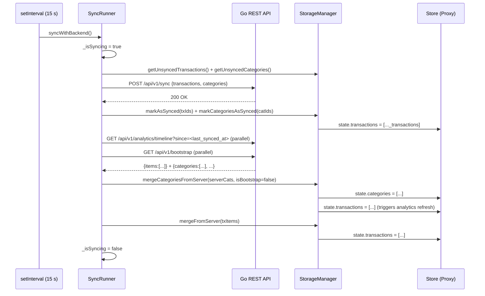

# FlowMoney — System Architecture Specification

> **Single Source of Truth.** Full static-analysis audit of all live source files, 2026-07-01.

---

## 1. SYSTEM OVERVIEW & ARCHITECTURAL STYLE

### 1.1 Stack

| Layer | Technology | Version / Detail |
|---|---|---|
| Language | Go | 1.21 (`go.mod`) |
| HTTP router | `github.com/go-chi/chi/v5` | v5.1.0 |
| DB driver | `pgx/v5` (pgxpool) | v5.6.0 |
| Database | PostgreSQL | 16-alpine (docker-compose) |
| Direct Go deps | — | **Two** runtime deps: chi, pgx. Zero ORM. |
| Query generator | sqlc v1.31.1 | `sqlc.yaml` → `internal/repository/postgres/` |
| Frontend | Vanilla JS + CSS | No framework, no bundler, no transpiler, no TypeScript |
| Container | Docker multi-stage | `golang:1.21-alpine` → `alpine:3.19` |
| Reverse proxy | Caddy | Not in repo; assumed production TLS termination |
| CI/CD | GitHub Actions | SSH → `git pull` → `docker compose up --build` → homegrown migration runner |
| Migration tracker | Homegrown shell + `_schema_migrations` table | Not golang-migrate |
| Exposed port | `8082:8082` | `docker-compose.yml`, `config.go` default `PORT=8080` overridden |

### 1.2 Architectural Pattern

```
┌─────────────────────────────────────────────────────────────────────┐
│   Telegram Mini App (WebView)                                       │
│   ┌────────────────────────────────────────────────────────────┐   │
│   │  Offline-First Event-Driven SPA (Vanilla JS + Proxy Store) │   │
│   │                                                            │   │
│   │  localStorage (transactions, categories, last_synced_at)  │   │
│   └────────────────────────────┬───────────────────────────────┘   │
└────────────────────────────────│────────────────────────────────────┘
                                 │ HTTPS / JSON REST (Telegram initData)
                    ┌────────────▼───────────────┐
                    │  Go REST API (chi)          │
                    │  pkg/tgauth — HMAC-SHA256   │
                    │  service/rates — 12 h tick  │
                    └────────────────────────────┘
                                 │ pgx/v5 pool
                    ┌────────────▼───────────────┐
                    │  PostgreSQL 16              │
                    │  (soft-delete everywhere)   │
                    └────────────────────────────┘
```

**Data lifecycle (user action → DB):**

1. User interaction → `handleAddTransaction()` / `CategoryCreationSheet._confirm()`
2. `StorageManager.saveTransactionLocally()` / `saveUserCategory()` — UUID assigned client-side, written to `localStorage`, `Store.state` updated immediately (optimistic update, `synced: false`)
3. UI reactively updates via `Store` Proxy subscriptions (zero network wait)
4. `SyncRunner.syncWithBackend()` fires (immediately out-of-band + every 15 s)
5. `_push()` — `POST /api/v1/sync` with pending transactions + categories; server runs `UpsertTransaction` / `UpsertCategory` in a single DB transaction; on 200: `markAsSynced()` / `markCategoriesAsSynced()` clears `synced: false`
6. `_pull()` — concurrent `GET /api/v1/analytics/timeline` + `GET /api/v1/bootstrap`; server-side state merged into local store

### 1.3 Global Middleware Stack (chi)

Applied unconditionally to all routes, in order:

```
middleware.Logger → middleware.Recoverer → middleware.RealIP
```

`/api/v1/*` additionally wraps with `deliveryhttp.TelegramAuth(cfg.BotToken)`.

### 1.4 Required Environment Variables

| Variable | Default | Notes |
|---|---|---|
| `PORT` | `8080` | Overridden to `8082` in docker-compose |
| `TELEGRAM_BOT_TOKEN` | — | `mustEnv()` — panics if absent |
| `DB_USER` | — | `mustEnv()` |
| `DB_PASSWORD` | — | `mustEnv()` |
| `DB_NAME` | — | `mustEnv()` |
| `DB_HOST` | `localhost` | `getEnv()` with fallback |
| `DB_PORT` | `5432` | `getEnv()` with fallback |
| `DB_SSLMODE` | `disable` | `getEnv()` with fallback |

---

## 2. DATABASE & DATA SCHEMA

### 2.1 Full DDL — All 7 Migrations In Order

```sql
-- 000001_init_schema.up.sql

CREATE TABLE users (
    tg_id      BIGINT      PRIMARY KEY,
    currency   VARCHAR(10) NOT NULL DEFAULT 'USD',
    created_at TIMESTAMPTZ NOT NULL DEFAULT NOW(),
    updated_at TIMESTAMPTZ NOT NULL DEFAULT NOW()
);

CREATE TABLE categories (
    id         UUID        PRIMARY KEY,
    user_id    BIGINT      NOT NULL REFERENCES users(tg_id) ON DELETE CASCADE,
    name       VARCHAR(64) NOT NULL,
    color      VARCHAR(16) NOT NULL,
    icon       VARCHAR(64) NOT NULL,
    is_system  BOOLEAN     NOT NULL DEFAULT FALSE,
    sort_order INT         NOT NULL DEFAULT 0
);

CREATE INDEX idx_categories_user_id ON categories(user_id);

CREATE TABLE transactions (
    id          UUID           PRIMARY KEY,
    user_id     BIGINT         NOT NULL REFERENCES users(tg_id) ON DELETE CASCADE,
    category_id UUID           NOT NULL REFERENCES categories(id) ON DELETE RESTRICT,
    amount      DECIMAL(18, 2) NOT NULL CHECK (amount > 0),
    created_at  TIMESTAMPTZ    NOT NULL DEFAULT NOW(),
    is_deleted  BOOLEAN        NOT NULL DEFAULT FALSE
);

CREATE INDEX idx_transactions_user_id    ON transactions(user_id);
CREATE INDEX idx_transactions_created_at ON transactions(created_at DESC);
CREATE INDEX idx_transactions_user_timeline
    ON transactions(user_id, created_at DESC) WHERE is_deleted = FALSE;

CREATE TABLE budgets (
    user_id       BIGINT         PRIMARY KEY REFERENCES users(tg_id) ON DELETE CASCADE,
    weekly_limit  DECIMAL(18, 2) NOT NULL DEFAULT 0 CHECK (weekly_limit >= 0),
    monthly_limit DECIMAL(18, 2) NOT NULL DEFAULT 0 CHECK (monthly_limit >= 0)
);
```

```sql
-- 000002_seed_system_categories.up.sql
-- System user (tg_id = 0): sentinel owner of 8 legacy system categories.
-- IMPORTANT: These categories are NO LONGER returned to users.
-- GetCategoriesByUserId queries WHERE user_id = $1 (real tg_id), which
-- never matches tg_id = 0. This data is effectively dead/legacy.

INSERT INTO users (tg_id, currency) VALUES (0, 'USD') ON CONFLICT DO NOTHING;

INSERT INTO categories (id, user_id, name, color, icon, is_system, sort_order) VALUES
  ('11111111-1111-1111-1111-111111111101', 0, 'Еда',       '#FF6B6B', '🍕', true, 1),
  ('11111111-1111-1111-1111-111111111102', 0, 'Транспорт', '#4ECDC4', '🚇', true, 2),
  ('11111111-1111-1111-1111-111111111103', 0, 'Покупки',   '#45B7D1', '🛍️', true, 3),
  ('11111111-1111-1111-1111-111111111104', 0, 'Здоровье',  '#96CEB4', '💊', true, 4),
  ('11111111-1111-1111-1111-111111111105', 0, 'Кафе',      '#FFEAA7', '☕', true, 5),
  ('11111111-1111-1111-1111-111111111106', 0, 'Спорт',     '#DDA0DD', '⚽', true, 6),
  ('11111111-1111-1111-1111-111111111107', 0, 'Дом',       '#98D8C8', '🏠', true, 7),
  ('11111111-1111-1111-1111-111111111108', 0, 'Другое',    '#B0C4DE', '💡', true, 8)
ON CONFLICT (id) DO NOTHING;
```

```sql
-- 000003_add_transactions_updated_at.up.sql

ALTER TABLE transactions
    ADD COLUMN updated_at TIMESTAMPTZ NOT NULL DEFAULT NOW();

UPDATE transactions SET updated_at = created_at;  -- backfill existing rows

CREATE INDEX idx_transactions_user_updated_at
    ON transactions(user_id, updated_at ASC);
```

```sql
-- 000004_add_transactions_currency.up.sql

ALTER TABLE transactions
    ADD COLUMN currency VARCHAR(10) NOT NULL DEFAULT 'USD';
```

```sql
-- 000005_drop_budget_daily_limit.up.sql

ALTER TABLE budgets DROP COLUMN IF EXISTS daily_limit;
```

```sql
-- 000006_add_transaction_comment.up.sql

ALTER TABLE transactions ADD COLUMN comment VARCHAR(255) NOT NULL DEFAULT '';
```

```sql
-- 000007_add_categories_is_deleted.up.sql

ALTER TABLE categories ADD COLUMN is_deleted BOOLEAN NOT NULL DEFAULT false;
```

```sql
-- _schema_migrations (created inline by CI, not a migration file)
CREATE TABLE IF NOT EXISTS _schema_migrations (
    filename   TEXT        PRIMARY KEY,
    applied_at TIMESTAMPTZ DEFAULT now()
);
```

### 2.2 Full `transactions` Schema (Post All Migrations)

```sql
transactions (
    id          UUID           PRIMARY KEY,
    user_id     BIGINT         NOT NULL REFERENCES users(tg_id) ON DELETE CASCADE,
    category_id UUID           NOT NULL REFERENCES categories(id) ON DELETE RESTRICT,
    amount      DECIMAL(18, 2) NOT NULL CHECK (amount > 0),
    created_at  TIMESTAMPTZ    NOT NULL DEFAULT NOW(),
    is_deleted  BOOLEAN        NOT NULL DEFAULT FALSE,
    updated_at  TIMESTAMPTZ    NOT NULL DEFAULT NOW(),   -- migration 000003
    currency    VARCHAR(10)    NOT NULL DEFAULT 'USD',   -- migration 000004
    comment     VARCHAR(255)   NOT NULL DEFAULT ''       -- migration 000006
)
```

**Indexes on `transactions`:**

| Index | Columns | Condition | Used by |
|---|---|---|---|
| `idx_transactions_user_id` | `(user_id)` | — | General user scoping |
| `idx_transactions_created_at` | `(created_at DESC)` | — | Standalone sort queries |
| `idx_transactions_user_timeline` | `(user_id, created_at DESC)` | `WHERE is_deleted = FALSE` | `GetTimelineWithCursor` — cursor pagination |
| `idx_transactions_user_updated_at` | `(user_id, updated_at ASC)` | — | `GetTransactionsDelta` — delta sync |

### 2.3 Full `categories` Schema (Post All Migrations)

```sql
categories (
    id         UUID        PRIMARY KEY,
    user_id    BIGINT      NOT NULL REFERENCES users(tg_id) ON DELETE CASCADE,
    name       VARCHAR(64) NOT NULL,
    color      VARCHAR(16) NOT NULL,
    icon       VARCHAR(64) NOT NULL,
    is_system  BOOLEAN     NOT NULL DEFAULT FALSE,
    sort_order INT         NOT NULL DEFAULT 0,
    is_deleted BOOLEAN     NOT NULL DEFAULT false  -- migration 000007
)
```

**Key constraints:**

| Constraint | Meaning |
|---|---|
| `ON DELETE CASCADE` (categories → users) | Deleting a user wipes their categories |
| `ON DELETE CASCADE` (transactions → users) | Deleting a user wipes their transactions |
| `ON DELETE RESTRICT` (transactions → categories) | A category cannot be hard-deleted while transactions reference it; soft-delete is the only supported path |
| `CHECK (amount > 0)` | No zero or negative amounts at DB level |
| `WHERE categories.user_id = EXCLUDED.user_id` in `UpsertCategory` | UUID collision between users silently no-ops — prevents cross-user data mutation |

### 2.4 Named SQL Queries

| Query | Signature | Notes |
|---|---|---|
| `UpsertUser` | `(tg_id, currency) → User` | Creates user if absent; always sets `updated_at = NOW()` — acts as a login ping |
| `GetBudgetsByUserId` | `(user_id) → Budget` | Returns `pgx.ErrNoRows` if no budget row; handled in bootstrap handler |
| `GetCategoriesByUserId` | `(user_id) → []Category` | `WHERE user_id = $1 AND is_deleted = false ORDER BY sort_order ASC` — **does NOT return system categories (user_id=0) or soft-deleted entries** |
| `GetAnalyticsDonut` | `(user_id) → []donutItem` | Server-side aggregation; **UNUSED** — frontend calls `computeLocalDonutData()` instead |
| `GetTimelineWithCursor` | `(user_id, cursor TIMESTAMPTZ, limit int32) → []Transaction` | Cursor pagination; non-deleted only; uses `idx_transactions_user_timeline` |
| `GetTransactionsDelta` | `(user_id, updated_at TIMESTAMPTZ) → []Transaction` | Delta sync; includes `is_deleted=true`; `ORDER BY updated_at ASC` |
| `UpsertTransaction` | `UpsertTransactionParams → exec` | `ON CONFLICT (id) DO UPDATE`; `updated_at = NOW()` is server-assigned, never client-supplied |
| `UpdateUserCurrency` | `(tg_id, currency) → exec` | Sets `updated_at = NOW()` |
| `UpsertBudget` | `(user_id, weekly_limit, monthly_limit) → exec` | `ON CONFLICT (user_id) DO UPDATE` |
| `UpsertCategory` | `UpsertCategoryParams → exec` | `ON CONFLICT (id) DO UPDATE WHERE categories.user_id = EXCLUDED.user_id` |

---

## 3. SYNC ENGINE PROTOCOL & CONFLICT RESOLUTION

### 3.1 Architecture Overview

`SyncRunner` is a private IIFE module (`frontend/js/sync.js`) exposed as `window.SyncRunner`.

**Tick mechanism:**
- `SyncRunner.start()` wires `setInterval(syncWithBackend, 15_000)` + `window.addEventListener('online', syncWithBackend)`.
- An immediate attempt fires if `navigator.onLine === true` at startup.
- `SyncRunner.syncWithBackend()` is also called out-of-band immediately after every transaction save and category save/edit/delete.

**Mutex:** `_isSyncing` boolean prevents concurrent cycles. If a cycle is already in-flight, `syncWithBackend()` returns immediately. The flag is released in a `finally` block.

**Error handling:** All network errors are swallowed (`console.warn`). The cycle fails gracefully; the next tick or `online` event retries.



### 3.2 Push Phase (`_push`)

```
pending   = StorageManager.getUnsyncedTransactions()  // filter: !tx.synced
pendingCat = StorageManager.getUnsyncedCategories()   // filter: !cat.synced

if pending.length === 0 AND pendingCat.length === 0 → early return (no network call)

POST /api/v1/sync {
  "transactions": pending,
  "categories": pendingCat.map(c => { id, name, color, icon, sort_order, is_deleted })
}

→ 200 OK:
    StorageManager.markAsSynced(txIds)         // sets synced: true, _pending: false
    StorageManager.markCategoriesAsSynced(catIds)
→ non-2xx: throw Error → caught by syncWithBackend, retry next tick
```

**Server-side ordering:** the `NewSyncHandler` processes `categories` first, then `transactions`. This guarantees referential integrity: a transaction referencing a newly-created category will not fail the FK constraint `transactions → categories`.

**Idempotency:** both `UpsertTransaction` and `UpsertCategory` use `ON CONFLICT (id) DO UPDATE`. Retrying the same batch is safe.

**Optimistic UI:** `saveTransactionLocally()` writes to localStorage and sets `Store.state.transactions` immediately. The `synced: false` flag causes a `.sync-pending` indicator in the timeline until `markAsSynced()` clears it.

### 3.3 Pull Phase (`_pull`)

`_pull` issues two requests **concurrently** via `Promise.all`:

```
[txRes, bootstrapRes] = await Promise.all([
  GET /api/v1/analytics/timeline?since=<last_synced_at>   // if last_synced_at exists
  GET /api/v1/analytics/timeline?limit=200                // if first pull
  ,
  GET /api/v1/bootstrap
])
```

**Category pull (from bootstrap response):**

```
if bootstrapRes.ok:
  serverCats = bData.categories ?? []
  StorageManager.mergeCategoriesFromServer(serverCats, isBootstrap=false)
```

`bootstrap` is called every 15 seconds (not just at app start). This is the mechanism by which cross-device category changes (creates, edits, soft-deletes) propagate without a page reload.

**Transaction pull:**

| Condition | URL | Backend query | Includes `is_deleted: true` records? |
|---|---|---|---|
| `getLastSyncedAt() === null` (first ever sync) | `?limit=200` | `GetTimelineWithCursor` | No |
| Subsequent syncs | `?since=<last_synced_at>` | `GetTransactionsDelta` | **Yes** |

After a successful delta pull, `mergeFromServer(data.items)` scans all items for the maximum `updated_at` and persists it to `localStorage['flowmoney_last_synced_at']` — advancing the delta window for the next cycle.

### 3.4 Transaction Conflict Resolution (`StorageManager.mergeFromServer`)

Per-record merge rules applied in `storage.js`:

| Condition | Action |
|---|---|
| `serverTx.is_deleted === true` | `localMap.delete(serverTx.id)` — hard-remove from client state |
| `serverTx.id` not in `localMap` | Insert as new (`synced: true, _pending: false`) |
| `localMap[id]._pending === true` | **Skip** — record is in-flight; server must not overwrite |
| `localMap[id]._pending === false` | Replace with server version (`synced: true`) |

**Currency field preservation:**
```js
const currency = (local && local.currency) || serverTx.currency || Store.state.currency || 'RUB';
```
Priority: `local.currency` › `serverTx.currency` › current app currency › `'RUB'`.

### 3.5 Soft-Delete Retention Invariant (Categories)

Deleted categories are **retained** in the local `_userCategories` array with `is_deleted: true`. They are never removed from `Store.state.categories`. This is intentional:

- `CategoryCarousel.render()` filters `categories.filter(c => !c.is_deleted)` — deleted categories do not appear in the UI.
- `DonutChart.renderTimeline()` and `loadAnalyticsData()` look up categories from `Store.state.categories` (which includes deleted ones). A transaction referencing a deleted category still resolves its `name`, `color`, and `icon` correctly, preventing "Неизвестная" fallbacks in historical data.
- If deleted categories were removed from the store, every historical transaction referencing them would display with `color: '#888888'` and `name: 'Неизвестная'`.

### 3.6 Category Merge Rules (`StorageManager.mergeCategoriesFromServer`)

Two modes, controlled by the `isBootstrap` parameter:

**Bootstrap mode (`isBootstrap = true`):**
- Server list is absolute truth.
- Any local category absent from `serverCats` is marked `{ is_deleted: true, synced: true }`, regardless of its `synced` flag.
- This evicts zombie categories created on another client that were never confirmed by the server.

**Background pull mode (`isBootstrap = false`):**
- Only evicts local entries where `synced === true` (i.e., previously confirmed by server) that are absent from `serverCats`.
- Entries with `synced === false` (unconfirmed, in-flight) are not evicted — they may legitimately be ahead of the server.

**Per-server-category rules:**

| Condition | Action |
|---|---|
| `serverCat.is_deleted === true` | Mark local copy `is_deleted: true, synced: true` (retain in store for history) |
| `local.synced === false` | Skip — local is in-flight; server data is stale relative to it |
| Otherwise | Overwrite local with server version (`synced: true`) |

**UI update path (non-bootstrap only):**
After `_userCategories` is updated, `mergeCategoriesFromServer` explicitly calls:
1. `Store.state.categories = result` — triggers all Store `categories` subscribers
2. `Store.state.transactions = [...]` — forces analytics to refresh category names/colors
3. `CategoryCarousel.render(result)` — directly re-renders the carousel

The direct `CategoryCarousel.render` call bypasses the Store subscription (`Store.subscribe('categories', ...)`) to handle edge cases where the `Array.isArray` guard in the subscriber might short-circuit an empty-array eviction.

---

## 4. FRONTEND ARCHITECTURE & LIFE-CYCLE

### 4.1 Application Cold Start Sequence

```mermaid
flowchart TD
    A[DOMContentLoaded] --> B[Zoom locks: touchstart, gesturestart, touchend]
    B --> C[initTelegram: tg.ready, tg.expand, lockBodyHeight, safeAreaInsets]
    C --> D[initTheme: applyTheme + themeChanged subscription]
    D --> E[updateAnalyticsRange: compute start/end for 'month'\nStore.state.analyticsRange = {start, end}]
    E --> F[StorageManager.init: load _transactions from localStorage\nlegacy category migration check\nload _userCategories\nseed 3 defaults if first run\nStore.state.transactions = copy]
    F --> G[Settings.init: load budgets from localStorage\nStore subscriptions: weeklyLimit, monthlyLimit, transactions, rates]
    G --> H[BudgetCard.init: wire period toggle, Store subscriptions]
    H --> I[initBindings: Store subscriptions → DOM]
    I --> J[Router.init: wire nav tabs, currentTab = 'home']
    J --> K[NumPad.init: pointerdown delegation]
    K --> L[CategoryCreationSheet.init: emoji grid, color palette]
    L --> M[CategoryCarousel.init: delegated listeners\nStore.subscribe categories → render]
    M --> N[initAnalytics: Store subscriptions for currentTab, selectedAnalyticsCategory, transactions\ninitPeriodSwitcher, CalendarSheet.init, SwipeGesture.init]
    N --> O[initNetworkWatcher: online/offline → Store.state.isOnline]
    O --> P{Promise.all}
    P --> Q[bootstrap: GET /api/v1/bootstrap\nmerge categories, Store.batchUpdate\nCategoryCarousel.render explicit call]
    P --> R[wait 400ms min skeleton]
    Q --> S[hideSkeleton: fade-out 280ms, #app visible]
    R --> S
    S --> T[CategoryCarousel.render with Store.state.categories]
    T --> U[initialPull: GET /api/v1/analytics/timeline?limit=200\nStorageManager.mergeFromServer]
    U --> V[SyncRunner.start: immediate syncWithBackend if online\nsetInterval 15 000ms\nonline event listener]
```

**Critical ordering constraints:**
- `updateAnalyticsRange()` must run before any analytics subscription fires — it populates `Store.state.analyticsRange` with valid Unix-ms timestamps before the Store Proxy is subscribed to.
- `StorageManager.init()` must run before `Settings.init()` so `Store.state.transactions` exists when progress bars are computed.
- `bootstrap()` is gated behind `Promise.all` with a 400 ms minimum — ensures skeleton is shown ≥ 400 ms regardless of network speed.
- `CategoryCarousel.render` is called twice at the end of `init()`: once inside `bootstrap()` on the merged server result, and once after `Promise.all` resolves. This double-call ensures the carousel always reflects the final merged state even if `bootstrap()` modifies it after the internal `Store.batchUpdate`.
- `SyncRunner.start()` fires after `hideSkeleton()` — background sync never races with the initial render.

### 4.2 State Management Contract (`Store`)

`Store` is a private IIFE (`frontend/js/store.js`) that wraps a plain object in a recursive ES6 `Proxy`. Exposed as `window.Store`.

**Initial state keys (declared in `_initialState`):**

| Key | Type | Initial value | Notes |
|---|---|---|---|
| `currency` | `string` | `'₽'` | **Bug: initialized as symbol, not code.** Should be `'RUB'`. Replaced by bootstrap. |
| `weeklyLimit` | `number` | `0` | Replaced by Settings.init and bootstrap |
| `monthlyLimit` | `number` | `0` | Replaced by Settings.init and bootstrap |
| `inputAmount` | `string` | `''` | NumPad input |
| `selectedCategory` | `string\|null` | `null` | Selected category UUID for new transaction |
| `categories` | `Array` | `[]` | User category objects (includes `is_deleted` entries) |
| `transactions` | `Array` | `[]` | All transactions including soft-deleted |
| `pendingSync` | `Array` | `[]` | Unused in current code; legacy field |
| `isOnline` | `boolean` | `navigator.onLine` | |
| `analyticsPeriod` | `string` | `'month'` | `'day' \| 'month' \| 'custom'` |
| `analyticsRange` | `Object` | `{start: null, end: null}` | Unix-ms numbers; set by `updateAnalyticsRange()` |

**Dynamically added keys (not in `_initialState`):**

| Key | Set by | Subscribed by |
|---|---|---|
| `currentTab` | `Router.navigateTo()`, `Router.init()` | `initAnalytics()` |
| `selectedAnalyticsCategory` | `DonutChart._onTap()`, `DonutChart.resetFilter()` | `initAnalytics()` |
| `analyticsDonut` | `loadAnalyticsData()` | No subscriber (used as cache) |
| `rates` | `Store.batchUpdate` in `bootstrap()` | `Settings.subscribe('rates')`, `BudgetCard.subscribe('rates')` |

**Proxy behavior:**

```js
set(obj, prop, value) {
  if (old === value) return true;  // reference equality → no notification
  obj[prop] = value;
  _notify(rootKey || prop, value);
  if (rootKey) _notify(prop, value);
  return true;
}
get(obj, prop) {
  if (val is object) return _makeProxy(val, prop);  // nested proxy wrapping
  return val;
}
```

**Reference-equality bypass — known limitation:** Mutations to the same array/object reference (`arr.push(x)`) do NOT trigger notifications because `old === value` (same reference). The codebase works around this by always assigning a new array copy: `Store.state.transactions = [..._transactions]`. Nested object mutations via the Proxy DO fire, but only for the sub-key.

**`Store.batchUpdate(partial)`:** Sets all fields in `_state` directly (bypassing the Proxy `set` trap), then fires `_notify` once per key. Used during `bootstrap()` to batch-update `currency`, `weeklyLimit`, `monthlyLimit`, `categories`, `rates` without intermediate re-renders.

**`Store.subscribe(key, fn)`:** Registers `fn` in `_subscribers[key][]`; fires `fn` immediately with the current value; returns an unsubscribe function. No subscriptions are ever unsubscribed in the current codebase (all are permanent for the SPA lifetime).

### 4.3 Component Map & Render Mechanics

| Component | Module | Init location | Re-render trigger |
|---|---|---|---|
| `CategoryCarousel` | `app.js` IIFE | `CategoryCarousel.init()` | `Store.subscribe('categories')` + explicit `render(cats)` calls |
| `CategoryCreationSheet` | `app.js` IIFE | `CategoryCreationSheet.init()` | `open(cat)` / `open()` — imperative |
| `BudgetCard` | `app.js` IIFE | `BudgetCard.init()` | `Store.subscribe('weeklyLimit', 'monthlyLimit', 'transactions', 'currency', 'rates')` |
| `DonutChart` | `charts.js` IIFE | Called from `loadAnalyticsData()` | `loadAnalyticsData()` via `Store.subscribe('transactions')` |
| `Timeline` | `charts.js` IIFE | Called from `renderTimelineFromStore()` | Same as donut + `Store.subscribe('selectedAnalyticsCategory')` |
| `Settings` | `settings.js` IIFE | `Settings.init()` | `Store.subscribe('weeklyLimit', 'monthlyLimit', 'transactions', 'currency', 'rates')` |
| `CalendarSheet` | `app.js` IIFE | `CalendarSheet.init()` | Imperative: `open('start'|'end')` |
| `SwipeGesture` | `gestures.js` IIFE | `SwipeGesture.init(timelineEl, {onDelete, onDuplicate})` | Pointer events, not Store-driven |
| `Router` | `app.js` IIFE | `Router.init()` | `pointerdown` on `.nav-tab` |
| `NumPad` | `app.js` IIFE | `NumPad.init()` | `Store.subscribe('inputAmount')` via `initBindings()` |

### 4.4 localStorage Keys

| Key | Owner | Content |
|---|---|---|
| `flowmoney_transactions` | `StorageManager` | `JSON.stringify(_transactions)` — full transaction objects including `synced`, `_pending` fields |
| `flowmoney_last_synced_at` | `StorageManager` | RFC3339 string — maximum `updated_at` from last successful delta pull |
| `flowmoney_user_categories` | `StorageManager` | `JSON.stringify(_userCategories)` — all categories including soft-deleted, with `synced` field |
| `flowmoney_budgets` | `Settings` | `{weeklyLimit, monthlyLimit}` — offline persistence of budget limits |

### 4.5 Category Lifecycle (Client-Side)

```
User taps "+" → CategoryCreationSheet.open()
User fills name/emoji/color → _confirm()
  → StorageManager.saveUserCategory({...cat, synced: false})
    → _userCategories.push(entry)
    → localStorage[CATEGORIES_KEY] = JSON.stringify(...)
    → Store.state.categories = [...existing, entry]  ← triggers CategoryCarousel.render

User long-presses category → CategoryCreationSheet.open(cat)  [edit mode]
User saves → StorageManager.updateUserCategory({...cat, synced: false})
User deletes → StorageManager.updateUserCategory({...cat, is_deleted: true, synced: false})
  → Store.state.categories updated → CategoryCarousel.render filters out is_deleted entries
  → category stays in store for history resolution

SyncRunner._push → getUnsyncedCategories() → POST /api/v1/sync {categories:[...]}
  → markCategoriesAsSynced(ids) → category.synced = true
```

### 4.6 SPA Routing

- **No URL hashes.** Tab state lives entirely in `Store.state.currentTab` (`'home' | 'analytics' | 'settings'`).
- Screen visibility toggled via `classList.add/remove('active')` + `aria-hidden`.
- Transitions via CSS opacity/transform on `.active` class — no `display:none`.
- Tab clicks use `pointerdown` (not `click`) to eliminate the 300 ms tap delay.
- Each tab switch calls `tg.HapticFeedback.impactOccurred('light')`.

### 4.7 Theme Engine

`applyTheme()` maps 5 Telegram `themeParams` to CSS custom properties on `:root`:

| `themeParam` | CSS variable |
|---|---|
| `bg_color` | `--bg-color` |
| `secondary_bg_color` | `--secondary-bg-color` |
| `text_color` | `--text-color` |
| `hint_color` | `--hint-color` |
| `button_color` | `--accent-color` |

Theme changes dynamically without page reload via `tg.onEvent('themeChanged', ...)`.

### 4.8 Multi-Currency Engine

**Transaction currency isolation:** Each transaction has its own `currency` field locked at creation time (`Store.state.currency || 'RUB'`). It is never changed by sync or display operations.

**`computeLocalDonutData()` conversion formula (exact implementation):**
```js
const appCur     = (Store.state.currency || 'RUB').toUpperCase();
const txCurrency = (tx.currency || appCur).toUpperCase();

let amountInAppCurrency = parseFloat(tx.amount) || 0;
if (txCurrency !== appCur && rates[txCurrency] && rates[appCur]) {
  amountInAppCurrency = (amountInAppCurrency / rates[txCurrency]) * rates[appCur];
}
groups[tx.category_id] = (groups[tx.category_id] || 0) + amountInAppCurrency;
```

Both `txCurrency` and `appCur` are forcibly uppercased — prevents mismatches from mixed-case stored values vs. UPPERCASE API keys. Missing rate keys skip conversion (safe degradation).

**`DonutChart.refreshCurrencyLabels(newCurrency, freshData)`:** Text-only update. Does not touch SVG `<circle>` geometry. Matches legend items by `data-cat-id` attribute (not array index).

**Backend `RatesManager`:**
- Relative to USD (USD = 1.0). Hardcoded fallback: `{USD:1.0, RUB:93.50, GEL:2.72, EUR:0.92}`.
- Fetches live rates from `https://open.er-api.com/v6/latest/USD` on startup and every 12 h.
- `sync.RWMutex` — `Rates()` takes read lock and returns a **copy**; `fetch()` takes write lock.
- On fetch failure: `[RATES WARN]` logged; last known rates retained.

### 4.9 HMAC Authentication

**`pkg/tgauth/VerifyInitData` algorithm:**

1. URL-decode `initData`; extract and remove `hash` field.
2. Sort remaining `key=value` pairs alphabetically; join with `\n` → `dataCheckString`.
3. `secretKey = HMAC-SHA256("WebAppData", botToken)`
4. `expectedHash = HMAC-SHA256(secretKey, dataCheckString)` → hex-encoded.
5. Compare with `crypto/subtle.ConstantTimeCompare` (timing-safe).
6. Validate `auth_date`: must be present, parseable, and `≤ 86400 s` (24 h) old. Returns `ErrExpired` if stale.

**Middleware error map:**

| Condition | HTTP |
|---|---|
| Missing/malformed `Authorization` header | 400 |
| `ErrInvalidHash` | 401 |
| `ErrExpired`, missing `user` field, other parse errors | 400 |

### 4.10 API Route Map

**Public:**

| Method | Path | Response |
|---|---|---|
| `GET` | `/health` | `200 {"status":"ok"}` |
| `GET` | `/*` | Static files from `./frontend/`; SPA fallback to `index.html` |

**Protected (`Authorization: Telegram <initData>`):**

| Method | Path | Success | Errors |
|---|---|---|---|
| `GET` | `/api/v1/bootstrap` | 200 JSON | 401, 500 |
| `POST` | `/api/v1/sync` | 200 empty body | 400, 401, 500 |
| `PUT` | `/api/v1/settings` | 200 empty body | 400, 401, 500 |
| `GET` | `/api/v1/analytics/timeline` | 200 JSON | 400, 401, 500 |
| `GET` | `/api/v1/analytics/donut` | 200 JSON | 400, 401, 500 — **REGISTERED but UNUSED** |

**`POST /api/v1/sync` body (1 MB cap):**
```json
{
  "transactions": [
    { "id":"uuid", "category_id":"uuid", "amount":350.0, "currency":"RUB",
      "created_at":"2026-07-01T12:00:00Z", "is_deleted":false, "comment":"" }
  ],
  "categories": [
    { "id":"uuid", "name":"Кафе", "color":"#FFB347", "icon":"☕",
      "sort_order":2, "is_deleted":false }
  ]
}
```
Server processes `categories` before `transactions` (FK safety). Empty `currency` defaults to `"USD"`.

---

## 5. REFACTORING & SECURITY AUDIT FINDINGS

### 5.1 XSS Protection — Verified Safe

| Location | Method | Status |
|---|---|---|
| `CategoryCarousel.render()` | `createElement + textContent` for all user data | Safe |
| `CategoryCreationSheet` emoji/color grid | `createElement + textContent`; values are hardcoded EMOJIS/COLORS arrays | Safe |
| `DonutChart.renderTimeline()` — category name, icon, amount, time, comment | `createElement + textContent` throughout | Safe |
| `DonutChart.renderDonutChart()` — SVG segments | `_esc()` applied to `category_id` and `color` before `innerHTML` injection | Safe |
| `DonutChart` swipe-delete overlay | Hardcoded static SVG string; zero user data | Safe |
| `CalendarSheet.renderGrid()` | `document.createTextNode(String(day))` | Safe |
| `DonutChart.refreshCurrencyLabels()` | `textContent` for all text mutations | Safe |
| `Settings._openModal()` — title, currency symbol, amount | `textContent` | Safe |

### 5.2 Technical Debt — Active Issues

---

**TD-1 — First-Time User Empty Carousel (MEDIUM)**

**Root cause:** On first app launch, `StorageManager.init()` seeds 3 default categories with `synced: false`. Then `bootstrap()` calls `mergeCategoriesFromServer([], isBootstrap=true)`. The `isBootstrap=true` path evicts ALL local categories not returned by the server (server returns empty for new users). The evicted categories get `{ is_deleted: true, synced: true }`. Since they are now `synced: true`, `getUnsyncedCategories()` returns `[]` and `_push()` never sends them. The carousel is empty.

**Trigger:** New Telegram user, no prior sessions on this device.

**Fix direction:** Either seed default categories server-side (e.g., via `UpsertUser` trigger), or change the `isBootstrap` eviction to preserve `synced: false` entries even during bootstrap.

---

**TD-2 — Legacy System Categories Are Dead Data (LOW)**

**Root cause:** Migration `000002` seeds 8 categories with `user_id = 0`. `GetCategoriesByUserId` queries `WHERE user_id = $1 AND is_deleted = false`. Real users have `tg_id ≠ 0`, so system categories are never returned. The `is_system` column and `user_id = 0` sentinel are legacy. The `categories.is_system` boolean has no effect on any live query.

**Impact:** 8 rows of dead DB data; no user-visible effect.

**Fix direction:** Either drop the seed data and `is_system` column, or fix `GetCategoriesByUserId` to add `OR (is_system = true AND user_id = 0)` if system categories are intended to be re-enabled.

---

**TD-3 — Progress Bars Skip Multi-Currency Conversion (LOW)**

**Root cause:** `Settings.renderProgressBars()` computes spend as:
```js
const wSpent = txs.filter(...).reduce((s, tx) => s + Number(tx.amount), 0);
```
This adds raw transaction amounts without converting to `Store.state.currency`. `BudgetCard._computeAvailable()` (same conceptual calculation) correctly applies the cross-rate formula. Two divergent code paths produce inconsistent values when transactions are in multiple currencies.

**Impact:** Weekly/monthly progress bars may overstate or understate spend for multi-currency users.

**Fix direction:** Extract a shared `computeSpentInAppCurrency(txs, period, rates, appCur)` utility and use it in both `renderProgressBars` and `_computeAvailable`.

---

**TD-4 — `Store._initialState.currency = '₽'` (Symbol, Not Code) (LOW)**

**Root cause:** `store.js` line 16: `currency: '₽'`. This is the ₽ glyph, not the ISO code `'RUB'`. Before `bootstrap()` completes:
- `rates['₽']` is undefined → currency conversion is skipped silently
- `_handleCurrencyChange` would detect `oldCurrency = '₽'` and fail the `rates[oldCurrency]` check → budget limits would not be rescaled

**Impact:** Brief incorrect state during the 400 ms skeleton; no persistent effect after bootstrap resolves.

**Fix direction:** Change initial value to `'RUB'`.

---

**TD-5 — `Store.reset()` Does Not Clear Dynamic Keys (LOW)**

**Root cause:** `Store.reset()` calls `batchUpdate({..._initialState})`. Keys added after init (`currentTab`, `selectedAnalyticsCategory`, `analyticsDonut`, `rates`) are not in `_initialState` and are not reset. For a Mini App with no page lifecycle, this is not currently exploitable.

**Impact:** If `reset()` is ever called (e.g., for user logout), stale dynamic state persists.

---

**TD-6 — Unhandled Promise Rejection Path in `_push` for FK Violations (LOW)**

**Root cause:** If a transaction's `category_id` references a category that was deleted server-side (hard delete, not soft — currently impossible by design), `UpsertTransaction` throws a FK violation. The `_push` throws, caught by `syncWithBackend`'s `catch(err)` block with `console.warn`. The transaction remains `synced: false` and retries every 15 s indefinitely — no user-visible feedback, no circuit breaker.

**Impact:** Currently impossible due to soft-delete-only category policy, but the retry loop is unbounded.

---

**TD-7 — `/api/v1/analytics/donut` Registered but Never Called (INFO)**

The route `r.Get("/analytics/donut", deliveryhttp.NewGetAnalyticsDonutHandler(queries))` is registered in `main.go` line 67. The frontend calls `computeLocalDonutData()` instead. The handler exists, compiles, and responds correctly to requests, but receives zero traffic. The `GetAnalyticsDonut` SQL query (`DATE_TRUNC('month', NOW())`) uses the server's local clock, which differs from the client's date range logic.

---

**TD-8 — `initialPull` Always Fires, Not Guarded by Empty Store (LOW)**

`initialPull()` in `app.js` contains the comment "скачиваем историю, если localStorage пуст" but has no empty-check guard. It fires unconditionally on every app start (if online), even when `_transactions` has thousands of entries. The fetch returns `limit=200` non-deleted transactions, which `mergeFromServer` processes — resulting in redundant network and CPU work on returning users.

**Fix direction:** Guard with `if (StorageManager._dump().length === 0)` or add a `hasData()` method.

---

### 5.3 Key Timings Reference

| Behavior | Value |
|---|---|
| SyncRunner interval | 15 000 ms |
| Settings server sync debounce | 1 500 ms |
| Skeleton minimum display | 400 ms |
| Skeleton fade-out animation | 280 ms |
| Budget/currency sheet close animation | 340 ms |
| Numpad key press animation | 120 ms |
| Double-tap zoom threshold | 300 ms |
| Long-press category threshold | 500 ms |
| Swipe delete threshold | 100 px left |
| Swipe duplicate threshold | 60 px right |
| Swipe max drag (left / right) | 130 px / 70 px |
| Swipe resistance factor | 0.22 |
| RatesManager refresh interval | 12 h |
| RatesManager HTTP timeout | 10 s |
| DB pool ping timeout | 10 s |
| Graceful shutdown timeout | 10 s |

### 5.4 Server Timeouts

| Timeout | Value |
|---|---|
| `ReadTimeout` | 15 s |
| `WriteTimeout` | 15 s |
| `IdleTimeout` | 60 s |

### 5.5 NumPad Limits

| Limit | Home NumPad (transaction) | Budget Modal NumPad (settings) |
|---|---|---|
| Max integer digits | 6 | 7 |
| Max decimal digits | 2 | 2 |
| Max value | 999,999 | 9,999,999 |
| Source | `app.js MAX_DIGITS/MAX_AMOUNT` | `settings.js MAX_DIGITS/MAX_AMOUNT` |

DB `CHECK (amount > 0)` is the only server-side amount guard; no server-side upper-bound validation exists.

---

## 6. PROJECT FILE MAP

```
FlowMoney-app/
│
├── cmd/app/main.go              Entry point: config → DB pool → chi router → file server → graceful shutdown
│
├── internal/
│   ├── config/config.go         Reads env vars; mustEnv() panics on missing required vars; builds DatabaseURL
│   ├── delivery/http/
│   │   ├── middleware.go        TelegramAuth: HMAC verify + auth_date expiry → context inject telegram_id
│   │   ├── bootstrap.go        GET /bootstrap: UpsertUser + GetBudgetsByUserId + GetCategoriesByUserId + rates
│   │   ├── sync.go             POST /sync: 1 MB cap; single DB txn: UpsertCategory[] then UpsertTransaction[]
│   │   ├── settings.go         PUT /settings: UpdateUserCurrency + UpsertBudget; currency allowlist enforced
│   │   └── analytics.go        GET /analytics/timeline (?since= delta | ?cursor= cursor-page); donut handler (unused)
│   ├── repository/postgres/
│   │   ├── db.go               sqlc-generated: DBTX interface (Pool or Tx)
│   │   ├── models.go           sqlc-generated: User, Category, Transaction, Budget structs
│   │   ├── querier.go          sqlc-generated: Querier interface (10 named queries)
│   │   ├── queries.sql.go      sqlc-generated: all query implementations
│   │   └── queries/
│   │       └── queries.sql     Source SQL (10 named queries)
│   └── service/
│       └── rates.go            RatesManager: in-memory rates map, 12 h ticker, sync.RWMutex
│
├── pkg/tgauth/
│   ├── tgauth.go               VerifyInitData: HMAC-SHA256 + auth_date expiry; ErrExpired / ErrInvalidHash
│   └── tgauth_test.go          Unit tests: expiry path + happy paths
│
├── migrations/
│   ├── 000001_init_schema.up.sql
│   ├── 000002_seed_system_categories.up.sql     (legacy — categories no longer returned to users)
│   ├── 000003_add_transactions_updated_at.up.sql
│   ├── 000004_add_transactions_currency.up.sql
│   ├── 000005_drop_budget_daily_limit.up.sql
│   ├── 000006_add_transaction_comment.up.sql
│   └── 000007_add_categories_is_deleted.up.sql
│
├── frontend/
│   ├── index.html              Single HTML shell; skeleton loader; three screen divs; bottom nav
│   ├── css/style.css           All styles; CSS custom properties for Telegram theme vars
│   └── js/
│       ├── store.js            Proxy-based reactive Store; key-scoped subscriptions; batchUpdate; reset
│       ├── storage.js          StorageManager: localStorage r/w for transactions + categories;
│       │                       UUID gen; soft-delete; mergeFromServer; mergeCategoriesFromServer;
│       │                       bulkLoad; getLastSyncedAt; _persistLastSyncedAt
│       ├── sync.js             SyncRunner: 15 s interval; _isSyncing mutex; _push + _pull (concurrent bootstrap+timeline)
│       ├── settings.js         Settings: currency bottom sheet (3 contexts); budget modal; debounced PUT /settings;
│       │                       converter widget; progress bars
│       ├── app.js              App entry: Telegram SDK; Theme; Router; NumPad; CategoryCreationSheet;
│       │                       CategoryCarousel; BudgetCard; computeLocalDonutData; CalendarSheet; SwipeGesture;
│       │                       bootstrap(); initialPull(); init()
│       ├── charts.js           DonutChart: SVG donut (stroke-dasharray); legend; timeline DOM renderer;
│       │                       refreshCurrencyLabels (text-only update); _esc() XSS guard
│       └── gestures.js         SwipeGesture: pointer-event delegation; left=delete; right=duplicate;
│                               resistance damping; pointer capture for cross-boundary tracking
│
├── .github/workflows/deploy.yml    CI: SSH → git pull → docker compose up --build → homegrown migration runner
├── Dockerfile                  Multi-stage: builder (golang:1.21-alpine) → runtime (alpine:3.19)
├── docker-compose.yml          postgres:16-alpine + app; port 8082:8082; postgres healthcheck
├── sqlc.yaml                   sqlc codegen config
├── go.mod / go.sum             Module: github.com/flowmoney/app; 2 direct deps
└── .env.example                Documents required env vars
```
